>
해당 포스트는 
Youtube 채널
<a href='https://www.youtube.com/channel/UCX6b17PVsYBQ0ip5gyeme-Q' target='-blank'>'Crash Course'</a>
에서 제공하는 
<a href='https://www.youtube.com/playlist?list=PL8dPuuaLjXtNlUrzyH5r6jN9ulIgZBpdo' target='-blank'>'Computer Science'</a>
수업을 바탕으로 작성되었습니다.  
( 사진 속 인물은
<a href='https://about.me/carrieannephilbin' target='-blank'>'Carrie Anne Philbin'</a>
선생님 입니다! )

# 0. 시작하기에 앞서,

지난 수업에서 우리는 여러 논리회로를 조합해 ALU 회로를 구성해봤고,  
덕분에, 다양한 산술(Arithmetic), 논리(Logic) 연산을 처리할 수 있게 되었다.

하지만 당연하게도, 계산 결과를 단순히 출력하기만 하는 것보다  
그 값을 저장해뒀다가 다양한 방식으로 활용하는 것이 더 의미있을 것이다.

> 복잡한 작업을 처리하거나, 여러 연산을 연속적으로 수행하는 등

이 때, 컴퓨터가 정보를 '기억' 하기 위해 필요한 것이 '컴퓨터 메모리' 다.

## 0-1. 임의 접근 기억 장치(RAM)

데스크탑 컴퓨터나 콘솔 게임기로 게임을 하던 중,  
전원이 나가서 모든 것을 잃어본 경험이 있을 것이다.

- 특정 위치에서만 저장할 수 있는 RPG 게임이라던가..  
- 지뢰 찾기, 스도쿠 등의 복잡한 퍼즐 게임이라던가..

> 튕김으로 고통받은 모두에게 애도를 표합니다..

 

이런 사고는 콘솔 게임기, 노트북, 데스크탑 컴퓨터 등의 기계 장치에서  
**'Random Access Memory'(RAM)** 이 사용되기 때문에 발생한다.

> RAM(임의 접근 기억 장치)은 전원이 켜져있는 동안만 동작하는 메모리다.

## 0-2. 영구 기억 장치(PMem)

RAM과는 다르게, 전력 공급 없이도 기억을 유지하는 기억 장치도 있다.

바로, **'Persistent Memory(PMem)'** 이라는 장치다.

- PMem(영구 기억 장치) 는 RAM과는 다른 용도로 사용된다.
- 나중에 다른 수업에서 '메모리의 지속성' 과 함께 다뤄볼 것이다.

 

이번 수업에서는 가장 작은 단위인 1비트를 저장하는 회로에서,  
점점 규모를 키워(scale-up) 메모리 모듈까지 구성해볼 것이다.

그리고 최종적으로, 메모리와 ALU와 합쳐 CPU를 구성해볼 것이다.

# 1. 정보를 기억하는 회로

지금까지 구성해온 회로들은 모두 한 방향으로만 전기를 흘려보냈다.

> 지난 수업에서 구성한 리플 자리올림수 가산기도 마찬가지다.

하지만 이번엔, 입력받은 위치의 반대인 '앞 쪽'(forward) 이 아닌,  
출력 값을 뒤로 돌려서(loop back), 다시 회로에 입력하도록 구성해볼 것이다.

## 1-1. 1을 기억하는 회로

평범한 OR 회로을 이용해 새로운 회로를 구성해보자.

1. 출력선을 끌어와 입력선 중 하나에 연결한다.

2. 입력이 모두 0인 경우, '0 OR 0' 은 0이므로 0을 출력한다.

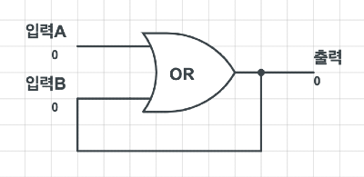

3. 입력A를 1 로 변경하면, '1 OR 0' 은 1이므로 1을 출력한다.

4. '3' 에서 출력된 1이 입력B로 전달되어 '1 OR 1' 이 된다.

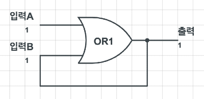

5. 이 때, 입력A에 다시 0을 입력해도 값은 1로 고정된다.

 

1이 출력된 이후로는 어떤 값을 입력해도 출력이 변하지 않기 때문에,  
이렇게 구성된 회로를 1의 값을 기록하는 회로라고 할 수 있다.

> 이 회로의 문제는 한번 값이 정해지면 다시 0으로 되돌릴 수 없다는 것이다.

## 1-2. 0을 기억하는 회로

위의 회로 구성에서 OR 회로를 AND 회로로 바꿔보자.

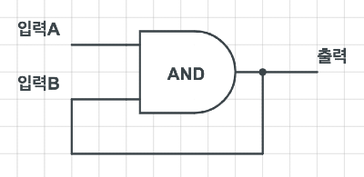

1. 입력이 모두 1인 경우, '1 AND 1' 은 1이므로 1을 출력한다.

2. 입력A를 0으로 변경하면, '0 AND 1' 은 0이므로 0을 출력한다.

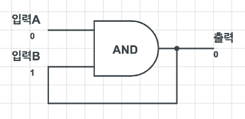

3. 입력A를 다시 1로 변경해도, '1 AND 0' 은 0이므로 0을 출력한다.

 

이렇게, 위에서 구성한 회로와는 반대로 0을 기억하는 회로가 된다.

> 이 회로 구성도 한번 값이 정해지면 다시 값을 바꿀 수 없다.

# 2. 래치

0과 1을 기록하는 회로들은 하나의 값만 저장할 수 있다는 문제가 있었다.

이 단편적인 회로들을 하나의 기억 장치 요소로 만들기 위해선,  
두 회로를 연결한 뒤에 구성을 약간 바꾸기만 하면 된다.

## 2-1. 구성

1. 위에서 구성한 값 기록 회로들을 준비한다.

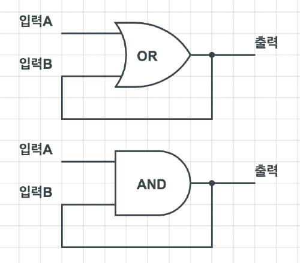

2. 각각의 기록 회로의 연결 구성을 바꾸고, NOT 회로를 추가한다.

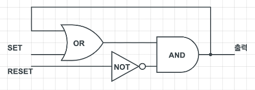

 

이렇게, 단일 비트의 정보를 기억하는 회로를 구성해봤다.

이제, 각각의 입력인 'SET' 과 'RESET' 의 값에 따른 회로의 변화를 살펴보자.

## 2-2. 동작 방식

래치의 동작 방식을 그림과 함께 간단하게 살펴보자.

1. SET에 1을 입력하면, 출력은 1이 된다.

2. 이 상태에서 RESET에 1을 입력하면, 출력은 다시 0이 된다.

3. 모든 입력이 0이 되면, 마지막에 입력된 값을 저장한다.

`이런 회로 상태가 되려면, RESET 의 입력을 먼저 0으로 바꿔야 한다.`
.png)

4. RESET에 1을 입력하면, 출력은 다시 0이 된다.

5. RESET의 입력을 다시 0으로 바꾸면, 마지막 값인 0이 저장된다.

.png)

 

이렇게, '특정한 값에 달라붙어서'(latches onto value) 저장하기 때문에,  
이런 구성의 회로를 **'Latsch'(래치)** 라고 부른다.

 

>
이 때, 기억 장치에 정보를 넣는 동작은 **쓰기(writing)** 라 하고,  
반대로, 정보를 빼오는 동작은 **읽기(reading)** 라 한다.

# 3. 게이트 래치

하나의 비트 정보를 저장하고 불러올 수 있는 것은 좋지만,  
두 가지 입력(set, reset) 을 조합하여 사용하는 것은 비효율적이다.

이 때, 값을 설정하면 바로 저장되는 입력선이 있다면,  
래치를 더 쉽게 조작할 수 있을 것이다.

>
간편하게 '쓰기' 동작을 할 수 있다는 것은 중요하지만,  
저장할 값을 유지하기 위해 입력 기능을 '잠그는' 선도 필요하다.

## 3-1. 회로 구성

논리 회로를 몇 개 추가하기만 해도, 이런 구성의 회로를 만들 수 있다.

- 주요 입출력선은 아래와 같다.
   - 정보 입력(data input)선
   - 쓰기 가능(write enable)선
   - 정보 출력(data output)선

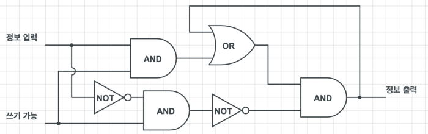

 

열거나 닫을 수 있는(enable/disable) 논리 회로(logic gate) 이기 때문에,  
이런 구성의 래치를 **'Gated Latch'(게이트 래치)** 라고 한다.

쓰기 기능을 제어할 수 있는 단일 비트 저장 회로를 구성해봤으니,  
이제, 이것을 단순화하여 더 높은 추상화 계층으로 넘어가보자.

## 3-2. 동작 방식

단순화된 게이트 래치 회로와 함께 동작 방식을 살펴보자.

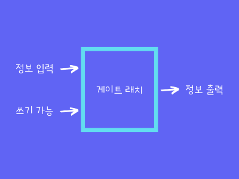

 

1. 초기 상태의 회로는 모든 값이 0이다.

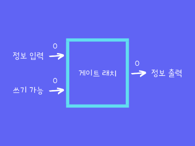

2. 입력을 1로 전환해도 값은 변하지 않는다.

클릭하여, 회로도의 상태를 살펴보자.

.png)

3. 입력이 0인 상태에서는 쓰기 기능을 활성화해도 값은 변하지 않는다.

클릭하여, 회로도의 상태를 살펴보자.

4. 쓰기 기능이 활성화된 상태에서 1을 입력하면 1이 출력, 저장된다.

클릭하여, 회로도의 상태를 살펴보자.

.png)

5. 쓰기 기능을 비활성화해도 값은 유지된다.

클릭하여, 회로도의 상태를 살펴보자.

.png)

.png)

6. 쓰기 기능이 비활성화된 상태면 0을 입력해도 값은 유지된다.

클릭하여, 회로도의 상태를 살펴보자.

.png)

.png)

7. 입력이 0인 상태에서 쓰기 기능을 활성화하면 0의 값이 출력, 저장된다.

클릭하여, 회로도의 상태를 살펴보자.

.png)

8. 쓰기 기능을 비활성화해도 값은 유지된다.

클릭하여, 회로도의 상태를 살펴보자.

.png)

.png)

 

이렇게, 일반 래치보다 사용하기 더 편리한 게이트 래치를 살펴봤다.

# 4. 레지스터

1비트만 저장하는 컴퓨터 기억 장치는 그렇게 유용하지 않다.  
`(80년대 아케이드 게임 'Frogger' 은 커녕, 아무것도 안돌아갈 정도;)`

물론, 래치를 무조건 1개만 사용해야 하는 것은 아니기 때문에,  
8개의 래치를 나란히 놓아 8비트 숫자와 같은 정보를 저장할 수도 있다.

 

이렇게 여러 개의 래치를 연결지어 구성한 회로를 **'Register'(레지스터)** 라고 한다.

레지스터는 여러 비트로 구성된 단일 정보를 기억하는데,  
이 때, 저장된 정보의 비트 수를 레지스터의 너비(width) 라고 한다.

>
초기에는 8비트 레지스터가 많이 사용되었지만,  
오늘날의 컴퓨터는 대부분 64비트 레지스터를 사용한다.

## 4-1. 동작 방식

레지스터에 정보를 저장하려면 쓰기 기능을 활성화해야 한다.

이 때, 8개의 쓰기 가능 입력을 각각 처리하는 것이 아니라,  
하나의 회로를 추가해 모든 래치를 제어할 수 있다.

1. 모든 쓰기 가능 입력을 단일 회로로 연결한다.

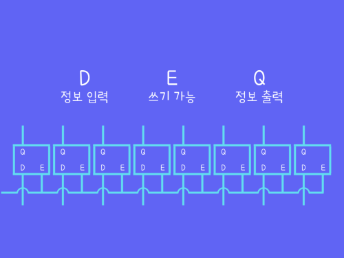

2. 단일 회로에 1을 입력해 쓰기 가능을 활성화한다.

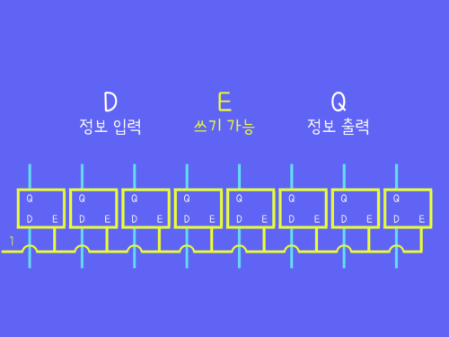

3. 각 래치의 정보 입력선에 1비트씩 값을 입력한다.

`'10110101' 을 입력한 경우의 예시`
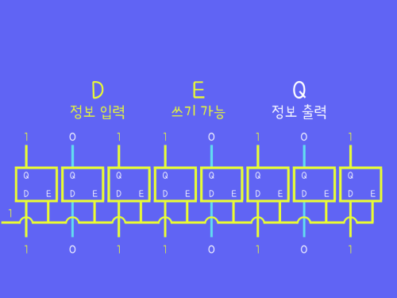

4. 쓰기 기능을 비활성화해도 값은 유지된다.

 

이렇게, 연속적인 비트의 조합을 하나의 단위 정보로 저장할 수 있다.  
`(위의 예시에서 구성한 레지스터는 너비가 8이므로, 8비트 레지스터라고 한다.)`

## 4-2. 문제

작은 규모의 정보를 저장하는 레지스터의 경우는 괜찮겠지만,  
더 큰 너비의 레지스터의 경우에는 해결해야할 문제가 하나 있다.

- 래치 1개당 입/출력선이 각각 1개씩 사용된다.
- 레지스터 전체에 쓰기 가능 연결선 1개가 사용된다.
- 따라서, 1개의 레지스터에는 '(너비 * 2) + 1' 개의 전선이 사용된다.  

 

위에서 살펴본 8비트 레지스터는 총 17개의 전선으로 해결 가능하지만,  
64비트 레지스터의 경우 구성하기 위해 129개의 전선을 필요로 한다.

> 256비트 레지스터의 경우, 레지스터 1개 당 513개의 전선이 사용될 것이다.

# 5. 행렬

래치를 나란히 배치하는 레지스터는 너비가 넓어지는 만큼 전선 수가 늘어나고,  
규모가 커질수록 문제가 심각해지기 때문에, 새로운 배열 방법을 찾을 필요가 있다.

이런 문제를 해결하기 위해 일렬로 배열하는 방법대신,  
**'Matrix'(행렬)** 구조를 적용해, 격자(grid) 에 배치해 볼 것이다.

## 5-1. 전체 구성

256비트 레지스터 기준, '16 * 16' 크기의 격자로 구성되는데,  
16개의 행(row) 과 열(column) 에 각각 래치가 배치되어 있다.

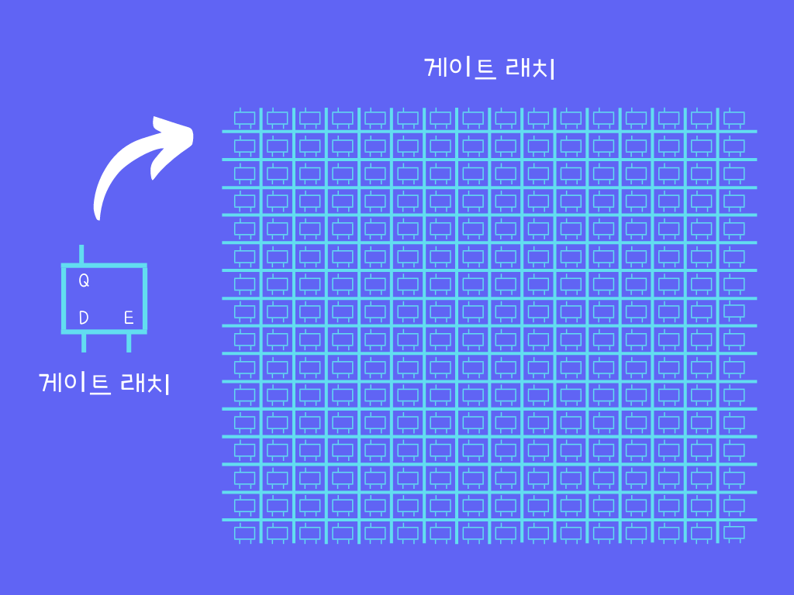

 

이 때, 임의의 래치를 하나 활성화하려면, 행 **그리고** 열을 함께 지정해줘야 한다.

클릭하여 위치 표현 방식을 확인해보자.

이 래치가 활성화된 것이다.

## 5-2. 세부 구성

클릭하여, 행렬 내부의 래치를 자세하게 살펴보자.

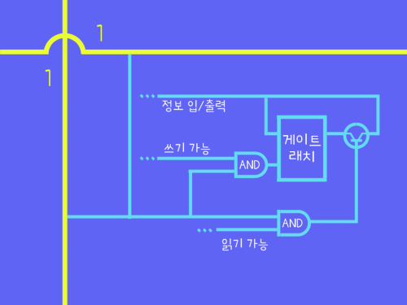

 

이번엔 행렬 구조에서 입/출력을 효율적으로 관리할 수 있도록 회로 구성을 변경해볼 것이다.

1. 활성화된 래치만 동작하도록 행, 열을 확인하는 위치 확인 회로를 추가한다.

- 행 **그리고** 열을 모두 만족해야 하기 때문에 AND 회로를 사용한다.

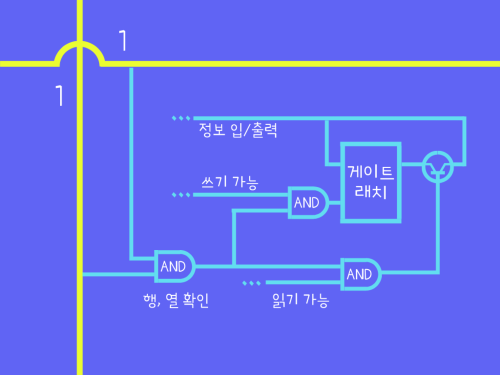

2. 위치 확인 회로의 출력을 기준으로 모든 래치의 상태가 구분된다.

2-1. 지정된 위치에 있는 래치

2-2. 다른 위치에 있는 래치

- 둘 중 하나만 1인 경우도 같은 상태가 된다.

3. 하나로 연결된 쓰기 가능 입력이 1인 경우에도 모든 래치가 구분된다.

3-1. 지정된 위치에 있는 래치

3-2. 다른 위치에 있는 래치

- 둘 중 하나만 1인 경우도 같은 상태가 된다.

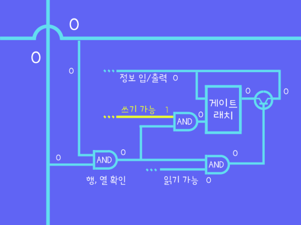

4. 모든 래치가 구분되기 때문에, 정보 입/출력을 단일 회로로 연결한다.

4-1. 활성화된 래치의 쓰기 기능을 활성화하고 1을 입력하는 경우

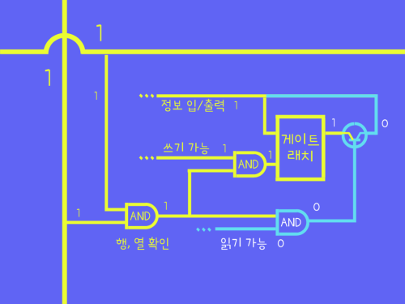

4-2. 이 상태에서 읽기 기능을 활성화하여 1을 출력하는 경우

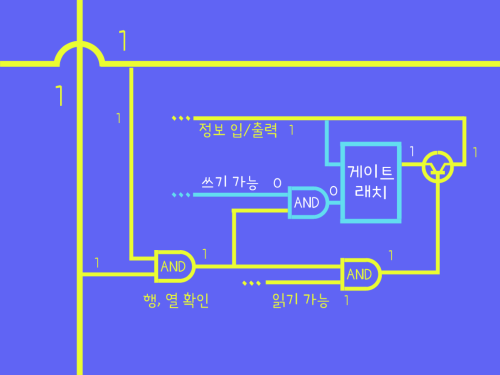

 

이렇게, 어떤 입력이 들어와도 활성화된 래치만 동작하기 때문에,  
여러 입력을 단일 회로로 제어해도 문제가 되지 않는다.

덕분에 총 35개의 전선만을 이용해 256비트 레지스터를 구성할 수 있었다.  
`(기존의 구성 방식은 513개 사용)`

- 행을 표시하는 전선 16개
- 열을 표시하는 전선 16개
- 정보 입/출력선 1개
- 쓰기 가능 입력선 1개
- 읽기 가능 입력선 1개

# 6. 메모리 주소

행렬 구조의 레지스터는 지정하는 정확한 행, 열을 표기하는 방법이 필요하다.

이 방법은 우리가 누군가를 만날 때, 약속 장소를 정하는 것에 비유할 수 있다.  
`(도로 이름 명칭이 까다로운 미국을 기준으로 살펴보자.)`

 

>
12번가 8번길(12th avenue, 8th street) 에서 보기로 약속했다면,  
두 개의 길이 정확히 교차하는 지점이 약속 지점이 될 것이다.

이 때, '12번가' 와 '8번길' 이 정확한 지점을 표시하는 **'주소'(address)** 라고 할 수 있다.

 

이 상황을 256비트 레지스터를 기준으로 바꿔서 보면,  
12번째 행, 8번째 열에 위치하는 래치를 가리킨다고 할 수 있다.

이 때, 256비트 레지스터는 최대 16개의 행과 열이 있기 때문에,  
이 위치 표시 값을 4비트(0~15) 로 표현할 수 있다.

1. 행의 위치를 표시하는 주소 값 12는 2진수로 '1100' 이다.
2. 열의 위치를 표시하는 주소 값 8은 2진수로 '1000' 이다.
3. 이 두 개의 주소 값을 하나로 합치면 '11001000' 이다.

이렇게, 특정한 위치에 있는 래치를 나타내기 위해 2진수로 구성된 메모리 주소 값을 사용할 수 있다.

# 7. 멀티플렉서

이렇게 정확한 위치를 표시하는 메모리 주소에 대해 알아봤으니,  
행과 열에 값을 입력하는 장치인 **'Multiplexer'(멀티플렉서)** 를 살펴보자.  
`(꽤 멋있는데, 나도 닉네임을 망고플렉서로 바꿔볼까..)`

다양한 크기의 멀티플렉서가 존재하지만, 256비트 레지스터를 기준으로 간단하게 살펴보자.

16개의 행과 열을 제어해야 하므로, 4비트(0~15) 멀티플렉서를 사용할 것이다.

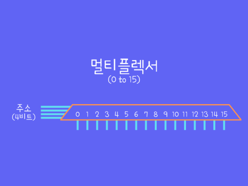

## 7-1. 구성

멀티플렉서가 적용된 레지스터를 그림과 함께 살펴보자.

256비트 레지스터에는 4비트 멀티플렉서가 총 2개 사용된다.

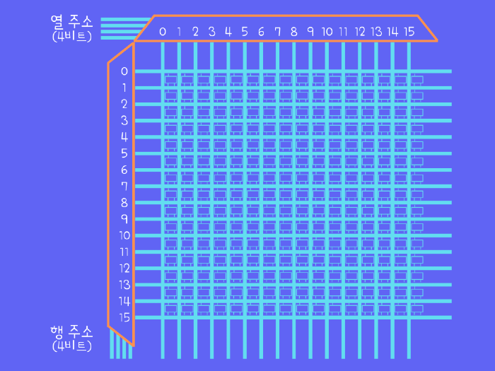

이 때, 행을 담당하는 멀티플렉서는 전체 구성을 기준으로 세로로 배치된다.

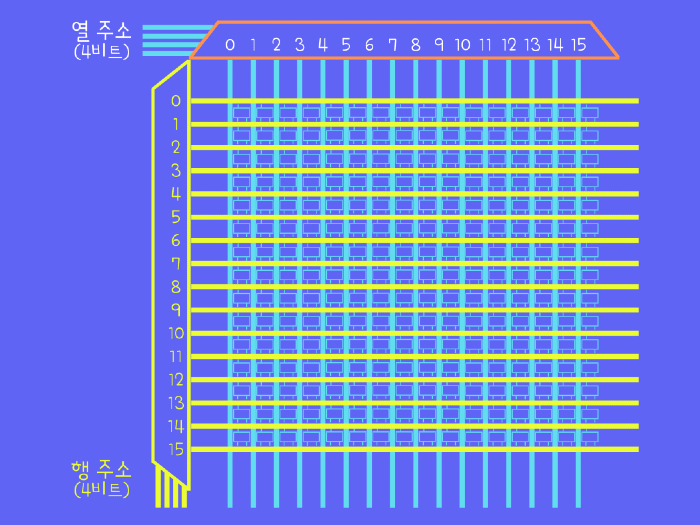

반대로, 열을 담당하는 멀티플렉서는 전체 구성을 기준으로 가로로 배치된다.

## 7-2. 동작 방식

멀티플렉서에 값이 입력된 상태를 그림과 함께 살펴보자.

행(row) 의 선택을 담당하는 멀티플렉서에 '0000' 이 입력된 경우

- 2진수의 '0000' 에 해당하는 값인 '0' 에 해당하는 행에 1이 입력된다.

열(column) 의 선택을 담당하는 멀티플렉서에 '0000' 이 입력된 경우

- 2진수의 '0000' 에 해당하는 값인 '0' 에 해당하는 열에 1이 입력된다.

열(column) 의 선택을 담당하는 멀티플렉서에 '0001' 이 입력된 경우

- 2진수의 '0001' 에 해당하는 값인 '1' 에 해당하는 열에 1이 입력된다.

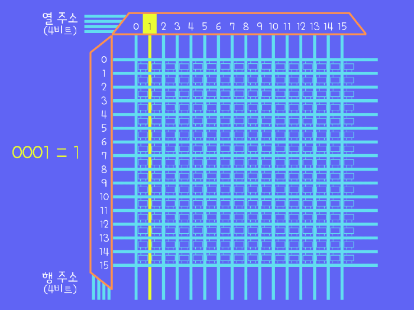

행과 열을 모두 지정하는 연속적인 값 '00100100' 이 입력된 경우

- '0010' 과 '0100' 에 해당하는 값인 '2' 와 '4' 에 위치하는 래치가 활성화된다.

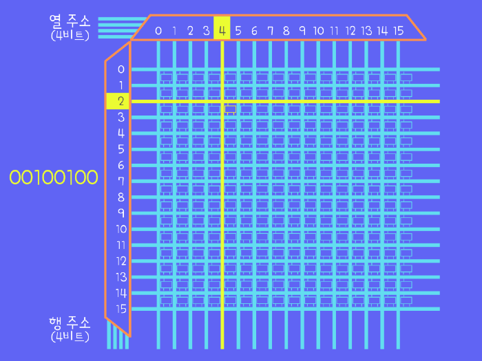

 

읽기와 쓰기가 가능한 256비트 기억 장치를 구성해봤으니,  
이 구성을 단순화하여 더 높은 추상화 계층으로 넘어가보자.

## 7-3. 추상화

**256비트 기억 장치의 구성을 정리하면, 아래와 같다.**

- 행과 열을 나타내는 8비트 주소값을 입력하는 회로가 있다.
- 쓰기와 읽기 기능을 제어하는 1비트 회로가 하나씩 있다.
- 정보의 입/출력을 담당하는 1비트 회로가 있다.

클릭하여, 그림으로 표현된 256비트 기억 장치를 살펴보자.

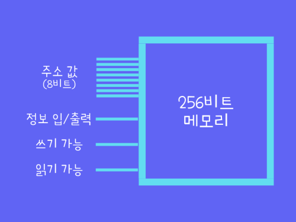

# 8. 메모리 모듈

256비트만으로는 할 수 있는 것이 거의 없기 때문에 확장이 필요하다.

256비트 기억 장치의 확장 과정을 그림과 함께 살펴보자.

1. 8개의 256비트 기억 장치를 레지스터를 구성했던 방식으로 나란히 놓는다.

2. 모든 기억 장치의 주소, 정보 회로는 모으고, 쓰기 가능, 읽기 가능 회로는 합친다.

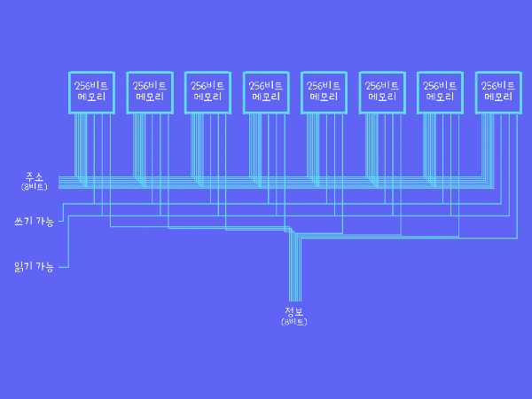

## 8-1. 특징

**이렇게 구성된 회로의 특징을 정리하면, 아래와 같다.**

- 8자리 비트로 구성된 주소 값을 사용한다.
- 쓰기 가능, 읽기 가능 회로는 모두 단일 회로로 합쳐진다.
- 

모든 기억 장치에 같은 주소 값과 쓰기 가능, 읽기 가능 값이 동시에 입력된다.

  
  

- 

정보의 입력, 출력은 8비트(1바이트) 단위로 처리된다.

  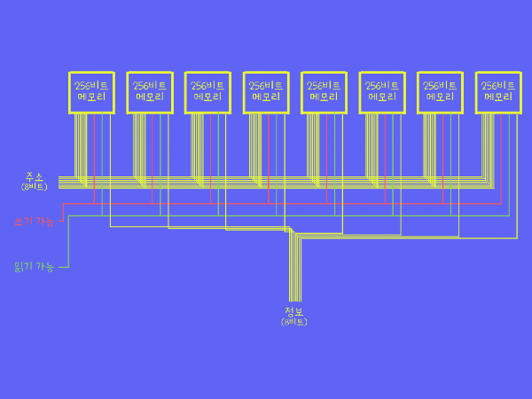
  

 

이렇게, 256개의 다른 주소에 1바이트 씩 정보를 저장하기 때문에,  
위 회로를 '256바이트 기억 장치' 라고 할 수 있다.

## 8-2. 추상화

회로의 구성이 복잡해졌으니, 추상화해보자.

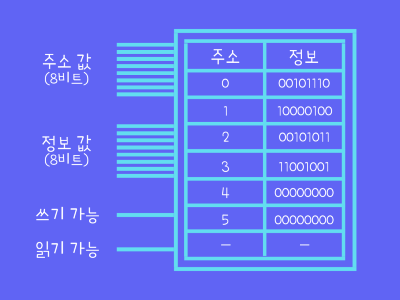

 

이렇게, 일렬로 연결된 기억 장치와 회로들을 하나의 단위로 구성한 것을  
**'메모리 모듈(memory module)'** 이라고 한다.  
`정확한 정의는 기억 장치 집적 회로가 장착된 기판이다.`

 

- 주소를 지정할 수 있는 기억 장치의 뱅크(bank)로 취급할 수 있다.
- 다음 수업에서 CPU를 구성하는데에 사용할 것이다.

'메모리 뱅크(memory bank)' 에 대하여 (수업에서는 설명하지 않는 부분)

`검색해보면 확실하게 '이거다!' 할 만한 내용은 없고, 크게 두 가지 유형으로 설명된다.`

1. 프로세서에 데이터가 지속적으로 흘러갈 수 있도록 순차적으로 작동하는 장치이며,  
   기억 장치 내부에 있는 분할된 구역이다.
   - 기억 장치와 CPU 사이의 정보 교환 속도를 빠르게 하기 위해 사용된다.
   - 표준 RAM 의 일부이거나 캐시와 같은 역할을 하는 저장 장치다.
2. 기억 장치와 관련된 용어 중, 'bank'(뱅크 혹은 메모리 뱅크) 가 표현하는 것은  
   프로세서가 한 번에 처리할 수 있는 최소 메모리 양이다.

자세한 내용은 아래의 링크 참고
- <a href='https://www.techopedia.com/definition/5533/memory-bank' target='-blank'>
  '1번 설명의 출처'
  </a>
- <a href='https://www.computerhope.com/jargon/b/bank.htm' target='-blank'>
  '2번 설명의 출처'
  </a>
- <a href='https://ko.wikipedia.org/wiki/%EB%A9%94%EB%AA%A8%EB%A6%AC_%EB%B1%85%ED%81%AC' target='-blank'>
  '위키피디아'
  </a>

## 8-3. 확장

지금까지 진행한 '작은 기억 장치들을 묶어, 더 큰 요소로 합치는 과정' 은  
현대 컴퓨터들의 저장 장치가 MB, GB 단위로 확장되기까지와 비슷하다.

덕분에, 이렇게 지속적으로 메모리 모듈을 연결, 재구성하면 규모를 늘릴 수 있다.

>
하지만, 메모리 위치(memory location)의 범위가 커지는 만큼 주소 값도 증가하기 때문에,  
8비트 주소 값은 256바이트 기억 장치 이상의 단위를 표현하기에는 부족하다.  
`(10억 바이트 규모인 기가바이트 단위의 주소를 표현하려면 32비트 주소가 필요하다.)`

 

**<작성 중인 글입니다.>**

**<아래 내용은 정리 중입니다.>**

# 9. 

이번 수업에서 배운 

 

오늘 배운 메모리의 중요한 특성은 언제, 어느 위치든 무작위 순서로 접근이 가능하다는 것이다.

그래서 임의 접근 메모리(Random Access Memory), RAM이라고 부르는 것이다.

컴퓨터에 얼마나 큰 RAM을 달았는지 얘기하는 것은 컴퓨터 메모리를 말하는 것이다.

>
RAM은 인간의 단기 또는 활동 중인 기억과 비슷하다.
>
사람은 일들이 잘 되고 있는지 계속 추적하고 있어야 한다.
>
내가 점심을 먹었는지, 전화 요금을 냈는지 하는 것들 말이다.

##

이게 진짜 막대기 모양의 RAM이다.

보드에 8개의 메모리가 납땜되어 있다.

메모리 모듈 한 개를 조심스럽게 열어서 확대해보면, 가장 먼저 32개의 메모리 사각형이 보인다.

이 사각형 하나를 확대하면, 4개의 블럭을 볼 수가 있다.

다시 한번 확대하면, 각각 비트의 행렬이 나온다.

이것은 128 * 64비트 행렬이다.

총 8192비트이다.

32개의 사각형이 각각 4개의 행렬을 갖고 있으니까, 32,768비트.

사각형이 32개니까, 이 칩에는 대략 백만비트가 있는 것이다.  
(32,768 * 32 = 1,048,576)

RAM 스틱에 이런 칩이 8개 있으니까, 총 8백만 비트 또는 1메가바이트를 저장할 수 있다.

이 메모리는 요즘 쓰이는 것이 아니고, 1980년대에 쓰이던 모듈이다.

요즘에는 기가바이트 이상의 메모리를 살 수 있다.

수십억 바이트의 메모리를 말이다.

# 10. 다양한 저장 장치

오늘 우리는 래치를 이용해서 SRAM(Static Random Access Memory) 한 조각을 만들어 봤다.

SRAM : 정적 무작위 접근 기억장치

DRAM, Flash 메모리, NVRAM과 같이 다른 종류의 RAM도 있다.

SRAM과 기능은 거의 유사하다.

각각의 비트를 저장하는 회로에 차이가 있는 것이다.

예를 들면, 다른 논리 회로, 축전기(캐패시터), 차지 트랩, 멤리스터가 있다.

그러나 근본적으로, 이 모든 기술은 메모리 셀이 대량으로 포개진 행과 열 안에서 정보 비트를 저장하는 기술들이다.

컴퓨팅의 많은 부분과 마찬가지로 기본적인 동작은 상대적으로 간단하다.

놀랄만한 추상화의 단계. 단계들이 있다.

점점 더 작아지는 러시아 인형처럼 말이다.

다음 주에 보자.
