>
해당 포스트는 
Youtube 채널
<a href='https://www.youtube.com/channel/UCX6b17PVsYBQ0ip5gyeme-Q' target='-blank'>'Crash Course'</a>
에서 제공하는 
<a href='https://www.youtube.com/playlist?list=PL8dPuuaLjXtNlUrzyH5r6jN9ulIgZBpdo' target='-blank'>'Computer Science'</a>
수업을 바탕으로 작성되었습니다.  
( 사진 속 인물은
<a href='https://about.me/carrieannephilbin' target='-blank'>'Carrie Anne Philbin'</a>
선생님 입니다! )

# 0. 시작하기에 앞서,

이번 수업에서는 프로세서에 대한 내용을 다룰 것이기 때문에,  
아마도 전체 강의 중에서 가장 복잡한 수업이 될 것이다.

지금까지의 수업에서 구성했던 요소들을 정리해보면 아래와 같다.

- 2진수를 받아 계산을 수행하는 **산술 논리 장치(ALU)**
- 단일 값을 저장하는 데에 유용한 선형적인 메모리 덩어리인 **레지스터(Register)**
- 많은 숫자를 각각 다른 주소에 저장할 수 있는 **임의 접근 기억 장치(RAM)**

<br>

이것들을 종합해, 컴퓨터의 핵심 장치인 **'CPU'** 를 구성해볼 것이다.

> CPU(Central Processing Unit) : 중앙 처리 장치

# 1. 명령어

'MS Office', 'Safari' 등 우리가 사용하는 프로그램이 실행되기 위해선,  
컴퓨터의 각 장치가 어떤 작업을 처리해야 하는 지 알려줘야 한다.

이 때, 컴퓨터에게 지시(instruct) 하는 내용을 **'명령어(instruction)'** 라 하고,  
CPU는 컴퓨터가 명령어에 해당하는 동작을 수행하도록 신호를 내보내는 역할을 한다.

**간단하게 예를 들어보자면 아래와 같다.**

- 덧셈, 뺄셈 등의 명령어가 입력되면, ALU가 수학적 연산을 처리하도록 한다.
- 메모리 명령어가 입력되면, 기억 장치를 이용해 값을 읽거나 쓰는 동작을 수행한다.

> ### 한 마디로,  
> 컴퓨터 프로그램은 명령어로 구성되어 있고, CPU에 의해 실행된다.

# 2. 마이크로아키텍처

CPU에는 많은 부품이 있기 때문에 모든 배선 구조를 파악하기 보다는,  
각 요소의 동작 방식에 초점을 맞춰 하나씩 나열하는 식으로 구성해 볼 것이다.

> 이렇게 기능에 집중된 설계 내용을 **마이크로아키텍처(Microarchitecture)** 라고 한다.

## 2-1. 프로세서 구성

이번 수업에서 사용할 CPU를 간단하게 구성해보자.

<details><summary>1. 지난 수업에서 구성한 RAM 모듈을 추가한다.</summary>

`단순하게 살펴보기 위해 작은 규모의 메모리를 사용한다고 가정할 것이다.`
- 사용 가능한 메모리 위치는 총 16군데다.
- 하나의 메모리 위치에서 저장하는 값은 8비트다.

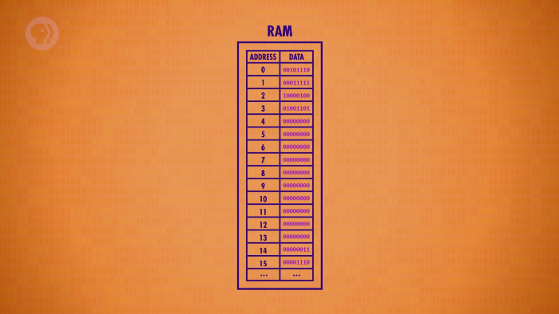
</details>

<details><summary>2. 8비트 메모리 레지스터 4개를 추가한다.</summary>

- 값을 임시로 저장하고, 조작하는 데에 사용할 것이다.
- 각 레지스터의 이름은 A, B, C, D라고 표기한다.

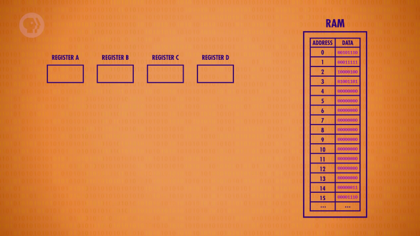
</details>

<details><summary>3. 명령어 주소 레지스터를 추가한다.</summary>

- 실행 중인 명령어의 메모리 주소를 저장한다.
- 프로그램의 어느 부분을 실행하고 있는 지 추적하기 위해 사용한다.

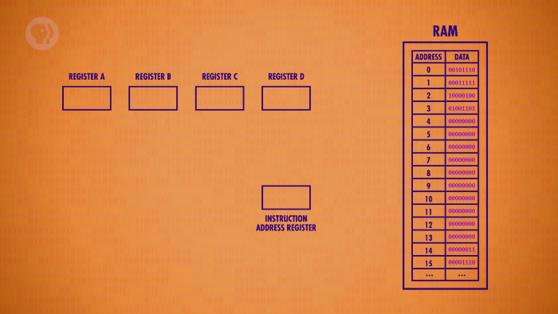
</details>

<details><summary>4. 명령어 레지스터를 추가한다.</summary>

- 실행 중인 명령어를 저장한다.
- 현재 수행 중인 명령의 내용을 저장하기 위해 사용한다.

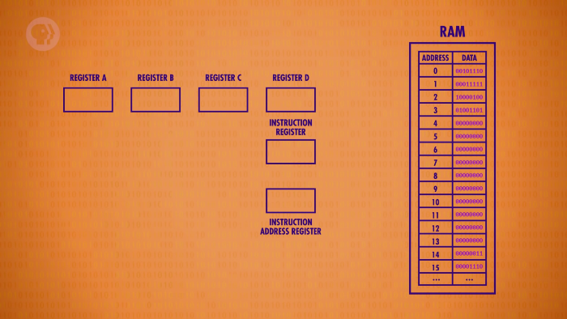
</details>

## 2-2. 명령어 구성

위에서 구성한 CPU가 처리할 명령어의 특징들을 정리해보면 아래와 같다.

<details><summary>클릭하여, 이번 수업에서 사용될 명령어들이 정리된 표를 살펴보자.</summary>

| 명령어 | 설명 | 4비트 명령 코드 | 주소 혹은 레지스터 |
|-|-|-|-|
| LOAD_A | RAM 위치를 레지스터 A로 읽어들인다. | 0010 | 4비트 RAM 주소 |
| LOAD_B | RAM 위치를 레지스터 B로 읽어들인다. | 0001 | 4비트 RAM 주소 |
| STORE_A | 레지스터의 값을 RAM 위치로 써넣는다. | 0100 | 4비트 RAM 주소 |
| ADD | 두 개의 레지스터에 저장된 값을 더하고, 두 번째 레지스터에 값을 더한다. | 1000 | 2비트 레지스터 ID, 2비트 레지스터 ID |
</details>

<br>

- 정보가 2진수 형태로 저장되듯이 각 프로그램을 비트로 표현한다.
- CPU가 지원하는 각각의 명령어에 ID를 할당해 사용한다.
- 이 명령 ID를 명령 코드(opcode, operation code) 라고 한다.
- 정보를 구성하는 8비트 중 앞부분의 4비트를 이용해 명령 코드를 나타낸다.
- 나머지 4비트는 해당 작업에 대한 정보의 출처(주소, 레지스터 등) 를 명시한다.

# 3. 명령 주기

간단한 컴퓨터 프로그램으로 RAM을 초기화하고 CPU의 동작을 살펴보자.

<details><summary>컴퓨터가 부팅된 시점에는 모든 레지스터의 값이 0에서 시작한다.</summary>

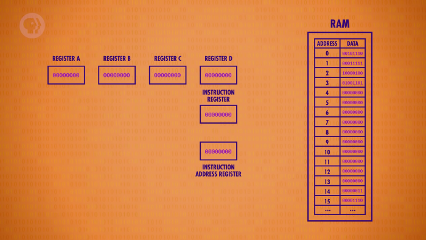
</details>

## 3-1. 인출 단계

CPU는 명령어를 받아오는 동작을 첫 번째로 수행하는데,  
이 과정을 **'fetch phase(인출 단계)'** 라고 한다.

<details><summary>1. 명령어 주소 레지스터를 RAM 모듈에 연결한다.</summary>

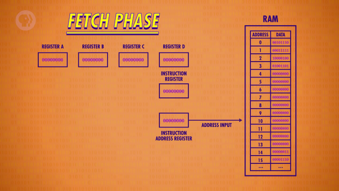
</details>

<details><summary>2. RAM에서 현재 레지스터의 값인 0에 해당하는 정보를 반환한다.</summary>

`현재 상황에선 '00101110' 의 값을 반환한다.`

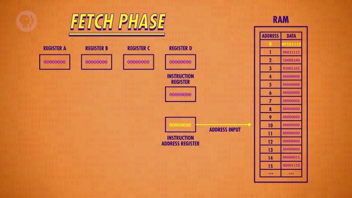
</details>

<details><summary>3. 반환된 값이 명령어 레지스터에 복사된다.</summary>

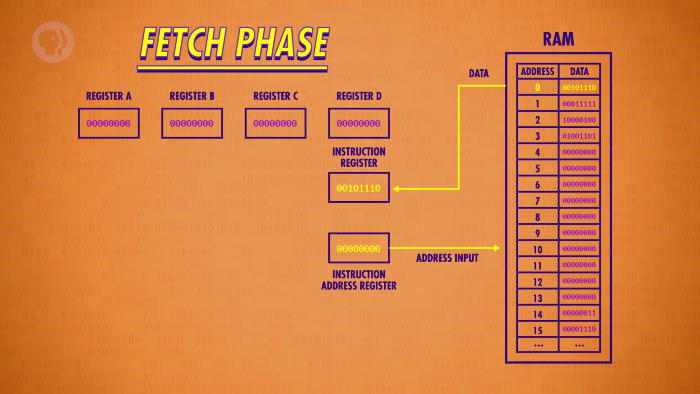
</details>

## 3-2. 해석 단계

다음으로, CPU는 해당 명령어가 어떤 작업을 가리키는 지 확인하는데,  
이 과정을 **'decode phase(해석 단계)'** 라고 한다.

<details><summary>1. 명령어의 앞부분(4비트) 에 해당하는 명령 코드를 확인한다.</summary>

`'00101110' 의 앞부분, '0010' 에 해당하는 명령어를 확인한다.`

<details><summary>명령 코드 '0010' 에 해당하는 명령 내용</summary>

| 명령어 | 설명 | 4비트 명령 코드 | 주소 혹은 레지스터 |
|-|-|-|-|
| LOAD_A | RAM 위치를 레지스터 A로 읽어들인다. | 0010 | 4비트 RAM 주소 |
</details>

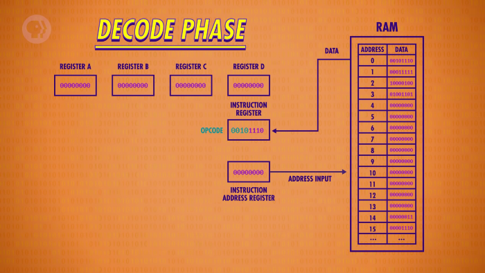
</details>

<details><summary>2. 나머지 부분(4비트)에 해당하는 정보의 출처를 확인한다.</summary>

`'00101110' 의 뒷부분, '1110' 에 해당하는 14번 메모리를 확인한다.`

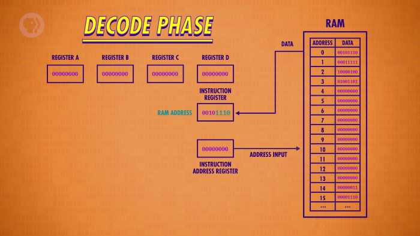
</details>

<details><summary>3. 제어 장치를 통해 명령어를 해석한다.</summary>

- 명령 코드를 입력받으면, 그에 맞는 출력선에 신호를 보낸다.
- 다른 요소들과 마찬가지로 여러 개의 논리 회로로 구성되어 있다.

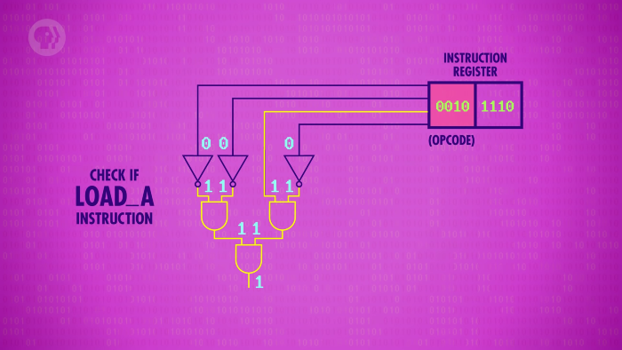
</details>

<details><summary>4. 제어 장치가 해석 결과를 출력한다.</summary>

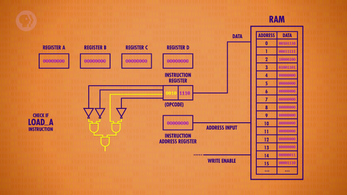
</details>

## 3-3. 실행 단계

처리하는 명령을 확인한 후에는 실제로 작업을 수행하는데,  
이 과정을 **'execute phase(실행 단계)'** 라고 한다.

<details><summary>1. 제어 장치의 출력으로 RAM의 읽기 기능이 활성화된다.</summary>

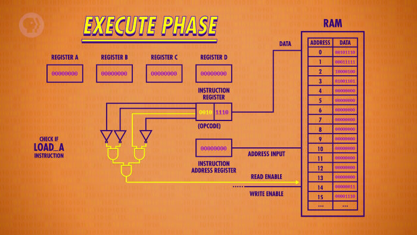
</details>

<details><summary>2. RAM의 지정된 위치에 접근한다.</summary>

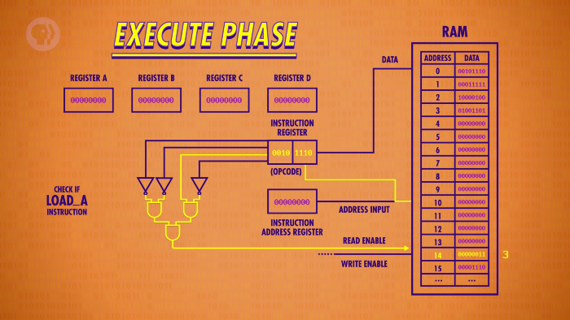
</details>

<details><summary>3. 명령에 관련된 회로들이 작동한다.</summary>

- 각각의 레지스터에는 정보 선이 연결되어 있다.
- 'LOAD_A' 명령에 영향을 받는 레지스터A만 쓰기 기능이 활성화된다.
- 쓰기 기능이 비활성화 상태인 다른 레지스터들은 영향을 받지 않는다.

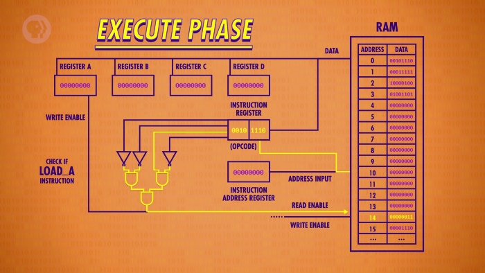
</details>

<details><summary>4. 동작이 수행된다.</summary>

- 00101110 : LOAD_A, 1110(14)  
  `(RAM의 14번 위치의 값을 레지스터A로 읽어들인다.)`

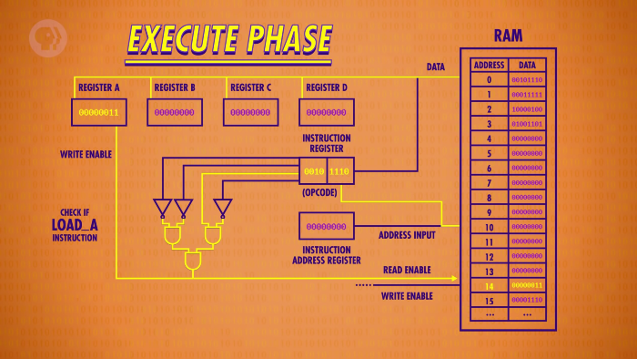
</details>

<details><summary>5. 명령이 처리되면, 다음 명령을 인출할 준비를 한다.</summary>

- 모든 연결선을 끄고, 명령어 주소 레지스터의 값을 1 증가시키며 실행 단계를 종료한다.

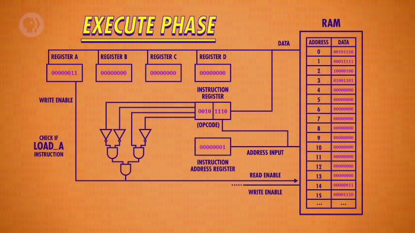
</details>

<br>

이렇게 CPU의 동작 단위인 **명령 주기(Instruction Cycle)** 에 대해 살펴봤다.

# 4. 제어 장치

위에서 살펴봤듯 제어 장치는 입력된 명령의 내용을 해석하는 역할을 한다.  
`(정확하게는, 명령 코드에 해당하는 회로에 전기를 흘려보낸다.)`

하지만, 이미 'LOAD_A' 의 동작 예시를 살펴봤기 때문에,  
복잡한 전체 회로를 살펴보기보단 하나의 요소로 단순화하여 살펴볼 것이다.

<details><summary>제어 장치는 오케스트라의 지휘자처럼 CPU의 모든 장치를 제어한다.</summary>

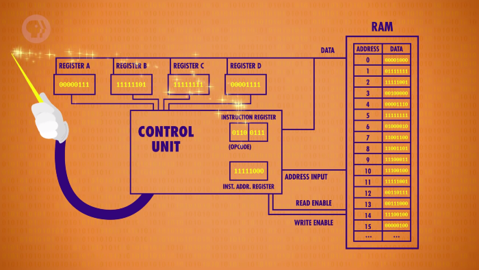
</details>

<br>

추상화된 제어 장치와 함께, 다시 한 번 CPU의 동작을 살펴보자.

<details><summary>1. 하나의 명령 주기가 끝난 시점에서 시작한다.</summary>

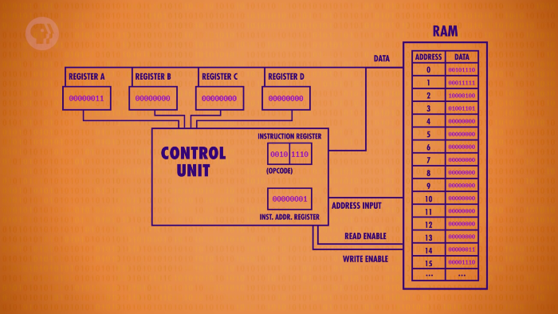
</details>

<details><summary>2. 명령어 주소에 대한 인출 단계가 진행된다.</summary>

- 명령어 주소 레지스터의 현재 값은 '00000001'(1) 이다.
- RAM에서 해당 위치(1) 에 저장된 정보(00011111) 를 반환한다.
- 명령어 레지스터에 '00011111' 값이 저장된다.

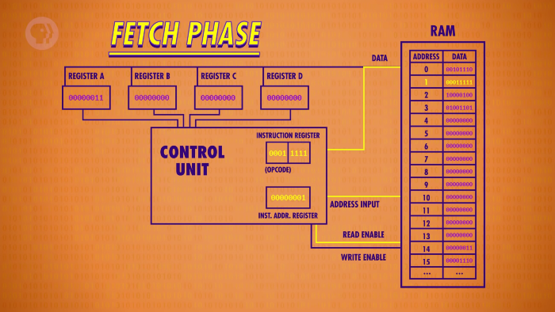
</details>

<details><summary>3. 명령어 값에 대한 해석 단계가 진행된다.</summary>

- 명령어의 앞부분 '0001' 에 해당하는 명령어 'LOAD_B' 를 확인한다.
- 나머지 부분 '1111' 에 해당하는 정보의 위치 '15' 를 확인한다.

<details><summary>명령 코드 '0001' 에 해당하는 명령 내용</summary>

| 명령어 | 설명 | 4비트 명령 코드 | 주소 혹은 레지스터 |
|-|-|-|-|
| LOAD_B | RAM 위치를 레지스터 B로 읽어들인다. | 0001 | 4비트 RAM 주소 |
</details>

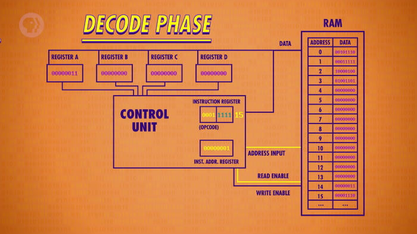
</details>

<details><summary>4. 해석된 내용을 바탕으로 실행 단계가 진행된다.</summary>

- RAM의 읽기 기능과 레지스터B의 쓰기 기능을 활성화한다.
- RAM의 지정된 위치(15) 에 접근하여 값을 레지스터B로 읽어들인다.

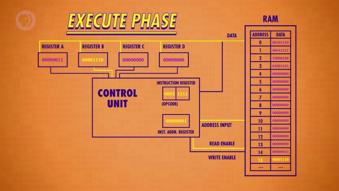
</details>

<details><summary>5. 명령이 처리된 후, 다음 명령의 인출 단계를 준비한다.</summary>

- 메모리 위치 15의 값 '00001110' 을 레지스터B에 읽어들이는 동작이 마무리된다.
- 모든 연결선을 끄고, 명령어 주소 레지스터의 값을 1 증가시킨다.

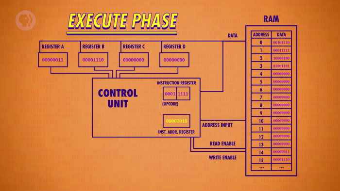
</details>

<br>

이렇게, 추상화된 **제어 장치(Control Unit)** 와 함께 명령 주기를 진행해봤다.

# 5. 연산 장치를 활용하는 명령

이번에는 지금까지와는 조금 다른 명령을 살펴볼 것이다.

<details><summary>1. 인출 단계를 진행한다.</summary>

- '00000010'(3) 에 위치한 정보인 '10000100' 이 명령어 레지스터에 복사된다.


</details>

<details><summary>2. 해석 단계를 진행한다.</summary>

- 명령어의 앞부분 '1000' 에 해당하는 명령어 'ADD' 를 확인한다.
- 해당 명령어는 정보의 출처를 2비트 단위로 2개 표기하기 때문에,  
  나머지 부분 '01' 과 '00' 에 해당하는 레지스터B와 A의 정보를 확인한다.

<details><summary>명령 코드 '1000' 에 해당하는 명령 내용</summary>

| 명령어 | 설명 | 4비트 명령 코드 | 주소 혹은 레지스터 |
|-|-|-|-|
| ADD | 두 개의 레지스터에 저장된 값을 더하고, 두 번째 레지스터에 값을 더한다. | 1000 | 2비트 레지스터 ID, 2비트 레지스터 ID |
</details>

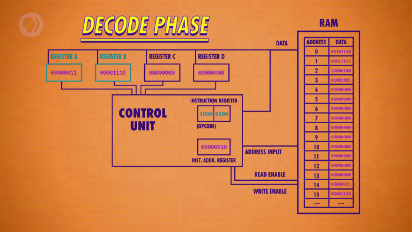
</details>

<details><summary>3. 실행 단계를 진행한다.</summary>
<details><summary>3-1. 명령을 실행하기 위해 CPU에 ALU를 결합한다.</summary>

`ALU는 원래 CPU에 기본적으로 탑재되어 있다.`

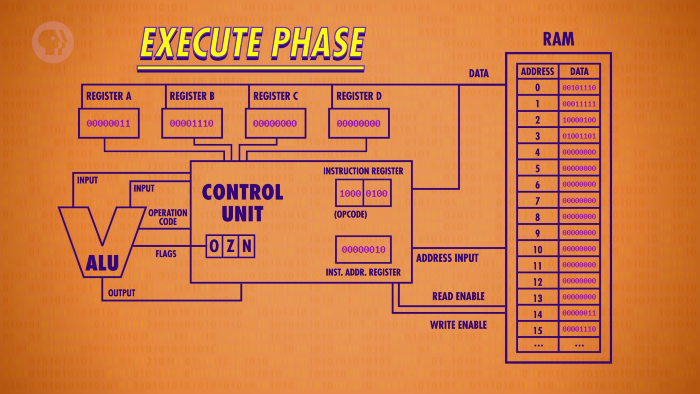
</details>
<details><summary>3-2. 제어 장치가 ALU에 값들을 입력해 연산 작업을 진행한다.</summary>

- 레지스터B의 읽기 기능을 활성화하여 값을 ALU의 입력1에 입력한다.
- 레지스터A의 읽기 기능을 활성화하여 값을 ALU의 입력2에 입력한다.
- ALU가 더하기 연산을 수행할 수 있도록 더하기 명령 코드를 입력한다.

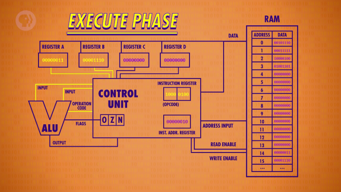
</details>

```
이 때, ALU가 처리한 연산의 결과를 직접적으로 레지스터A에 저장하게 되면,  
이 값이 다시 ALU에 지속적으로 입력되어 연산 작업이 반복되는 문제가 생긴다.

그렇기 때문에, 문제없이 실행 과정을 마치기 위해선 아래와 같은 추가 과정이 필요하다.
```

<details><summary>3-3. 연산 결과가 제어 장치에 임시로 저장된다.</summary>

- 이 때, 레지스터B에 있던 값 '14' 와 레지스터A에 있던 값 '3' 이 더해진 '17' 이 출력된다.

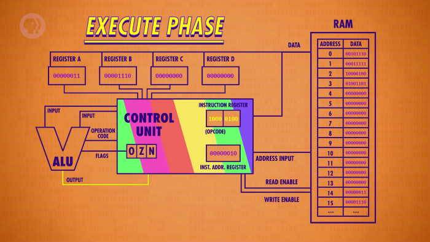
</details>
<details><summary>3-4. ALU와 관련된 모든 연결선이 비활성화되고, 레지스터 A에 값이 저장된다.</summary>

- 이 때, 레지스터A에는 '17' 의 2진수 값인 '00010001' 이 저장된다.

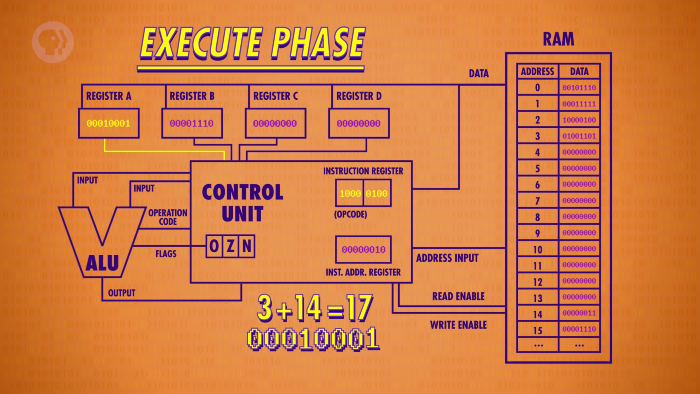
</details>
</details>

<details><summary>4. 다음 인출 단계를 준비한다.</summary>

- 동작이 마무리된 후, 모든 연결선을 끄고, 명령어 주소 레지스터의 값을 1 증가시킨다.

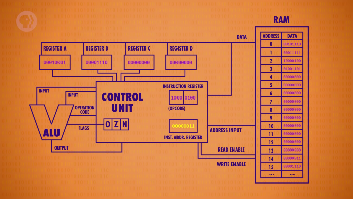
</details>

<br>

이렇게 연산 장치를 활용하는 명령이 처리되는 과정을 살펴봤다.

# 6. 기억 장치를 활용하는 명령

이제, 마지막 명령을 처리하는 과정을 살펴보자.

<details><summary>1. 인출 단계를 진행한다.</summary>

- '00000011' 에 위치한 정보인 '01001101' 이 명령어 레지스터에 복사된다.

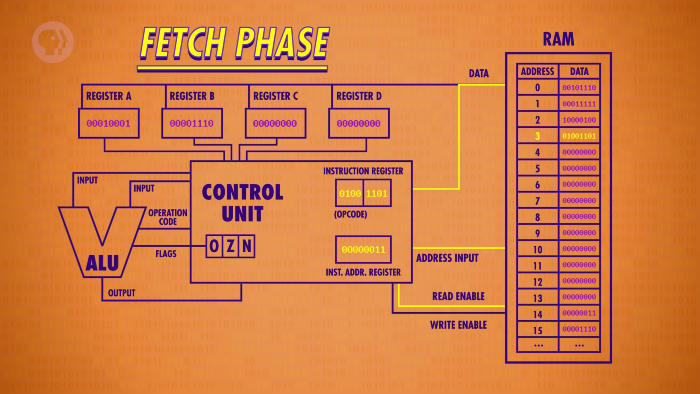
</details>

<details><summary>2. 해석 단계를 진행한다.</summary>

- 명령어의 앞부분 '0100' 에 해당하는 명령어 'STORE_A' 를 확인한다.
- 나머지 부분 '1101' 에 해당하는 정보의 위치 '13' 를 확인한다.

<details><summary>명령 코드 '0100' 에 해당하는 명령 내용</summary>

| 명령어 | 설명 | 4비트 명령 코드 | 주소 혹은 레지스터 |
|-|-|-|-|
| STORE_A | 레지스터의 값을 RAM 위치로 써넣는다. | 0100 | 4비트 RAM 주소 |
</details>
</details>

<details><summary>3. 실행 단계를 진행한다.</summary>
<details><summary>3-1. 이전의 동작들과는 다르게 RAM의 쓰기 기능을 활성화한다.</summary>

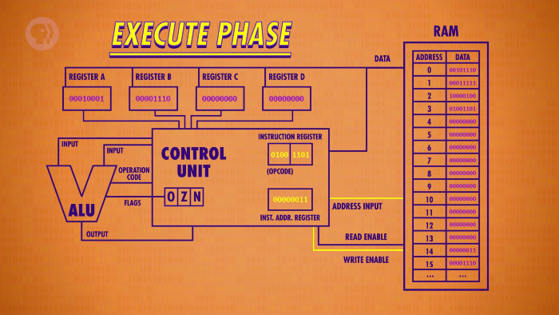
</details>
<details><summary>3-2. 레지스터A의 쓰기 기능을 활성화하여 RAM에 정보를 써넣는다.</summary>

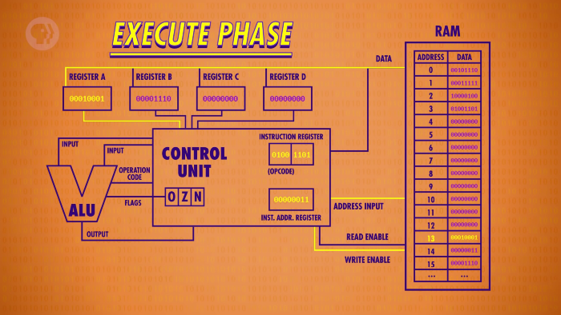
</details>
</details>

<br>

이렇게, 간단한 프로그램이 실행되는 과정을 살펴봤다.

>
메모리에 있는 2개의 값을 더하고, 그 결과를 다시 메모리에 저장하는 프로그램

# 7. 클럭

CPU가 작업을 진행하기 위해선 전기의 흐름이 지속적으로 바뀌어야 하는데,  
이 때, 규칙적인 간격으로 전기 신호를 발생시키는 장치를 **'클럭(Clock)'** 이라고 한다.  
`(똑딱똑딱.. 잘 어울리는 이름이다..)`

- <details><summary>클릭하여, 클럭이 포함된 회로 구성을 그림으로 살펴보자.</summary>

  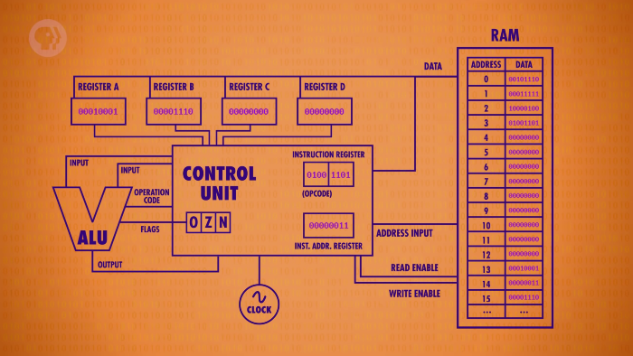
  </details>
- 배에서 북을 치며 노 젓는 박자를 맞추는 것을 떠올려보면 이해하기 쉽다.
- 특정 속도의 박자를 지속적으로 알려주는 메트로놈과도 비슷하다.

## 7-1. 클럭 속도

전선을 타고 이동한 전자의 상태가 안정화되려면 시간이 필요하기 때문에,  
적당한 주기로 전기 신호를 발생시켜, 안정적인 상태를 유지해야 한다.

이 때, CPU의 작업은 상태 전환에 의해 진행되고,  
상태 전환 속도는 전기 신호의 주기에 영향을 받기 때문에,

CPU의 작업 처리 속도를 **'클럭 속도(Clock Speed)'** 라고 한다.

- 1초 당 처리할 수 있는 작업의 수로 계산된다.
- 주파수의 단위인 Hz(헤르츠) 로 표시한다.
- 1초에 1개의 명령 주기가 완료되면 1Hz다.

<br>

>
수업에서 4개의 명령을 설명(12단계)하는데 6분(360초) 정도 걸렸으니,  
Carrie Anne 선생님의 클럭 속도는 약 0.03Hz 라고 할 수 있다.

# 8. 최초의 CPU

최초의 CPU는 1971년에 인텔에서 출시한 'Intel 4004' 다.

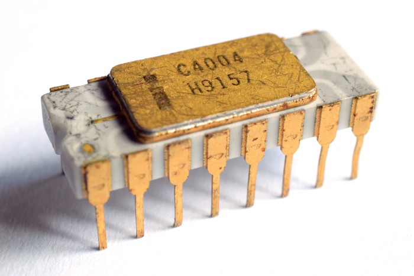

<details><summary>위에서 살펴본 CPU와 비슷한 마이크로아키텍처로 구성되어 있다.</summary>

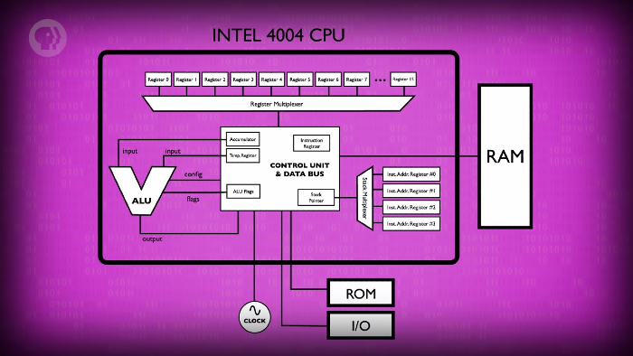
</details>

<br>

4비트 단위로 동작하는 단일 칩 구성의 CPU이고, 740KHz 의 속도로 작동했다.  
`(최초의 프로세서임에도 불구하고 초당 74만 개의 동작을 처리했다.)`

- 요즘 전자 기기에는 GHz 단위의 클럭 속도로 작동하는 CPU가 적용되어 있다.
- 1MHz 는 초당 백만 개, 1GHz 는 초당 수십억 개의 동작을 처리하는 속도다.

# 9. 동적 주파수 스케일링

오늘 날의 많은 프로세서들은 클럭의 속도를 필요한 만큼 늘리고 줄일 수 있다.

이런 작업을 **'동적 주파수 스케일링(dynamic frequency scaling)'** 이라고 하는데,  
이번엔 클럭 속도를 높이거나(over), 낮추는(under) 각각의 작업을 살펴볼 것이다.

- 클럭의 구성을 조작해 전기 신호 주기를 바꾸는 작업이다.
- 'CPU 스로틀링(CPU throttling)' 이라고 부르기도 한다.

## 9-1. 오버클럭

클럭의 주기를 변경해, CPU의 속도를 높이는 것을 **'오버클럭(overclock)'** 이라고 한다.  
`('컴퓨터를 오버클럭한다' 라는 말을 들어본 적 있을 것이다.)`

**특징을 정리하면 아래와 같다.**

- 노를 더 빨리 저으면 배가 더 빠르게 움직이는 것과 비슷한 원리다.
- 전기가 흐르는 만큼 열이 발생하기 때문에 냉각 작업이 중요하다.
- 과한 오버클럭 작업은 CPU를 과열시키거나, 전기 신호의 안정성을 낮춘다.
- CPU가 버틸 수 없는 온도에 지속적으로 노출되면 회로가 영구적으로 손상된다.  
  `(말 그대로, 타버린다..)`

## 9-2. 언더클럭

의도적으로 CPU의 속도를 낮추는 작업은 **'언더클럭(underclock)'** 이라고 한다.  

**특징을 정리하면 아래와 같다.**

- 프로세서가 최대 속도로 실행될 필요가 없을 때 매우 유용하다.  
   - 사용자가 자리를 비우거나, 실행 중인 프로그램이 없는 경우 등
- 발생되는 전기 신호가 줄어들기 때문에 전력 소비가 줄어든다.
   - 노트북, 스마트폰 등 배터리로 실행되는 장치에서는 매우 중요하다.
- 성능을 포기하고 장치의 수명을 늘리고자 하는 경우에 적용되기도 한다.

# 10. 프로세서에 관하여,

이렇게 클럭까지 추가해 CPU를 완성했으니, 추상화해보자.

<details><summary>클릭하여, 추상화된 상태를 그림으로 살펴보자.</summary>

- 지난 수업에서 살펴봤듯 RAM은 독립적인 구성 요소다.  
  `(전선을 이용해 주소, 기능 활성, 정보 등의 정보를 교환한다.)`
- 이런 이유로 자체 구성 요소로써 CPU의 외부에 존재한다.

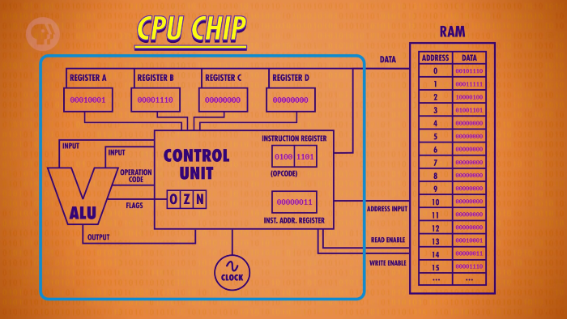
</details>

<br>

이번 수업에서는 간단한 구조의 CPU를 구성하고, 프로세서의 기본 원리에 대해 알아봤다.  
`(현대 프로세서에도 여전히 적용되는 원리들도 포함해서)`

다음 수업에서는 CPU를 확장해 여러 명령을 추가하고, 소프트웨어에 대해 살펴보자.

>
소프트웨어의 첫 걸음마를 떼어봅시다!  
\- Carrie Anne Philbin


# 배운 점, 느낀 점

컴퓨터가 동작하는 과정에 대해 이해할 수 있게 되서 기분이 좋았고,

추상화된 여러 회로에 전기가 통하면서 작업이 수행되는 과정이 너무 신기했다.

## 1.

- 작업을 수행하기 위해 CPU가 각 장치에 지시하는 내용인 명령어
- CPU에 관련된 핵심적인 내용만 정리한 내용인 마이크로아키텍처

<br>

컴퓨터가 처리해야 하는 동작을 표현하는 명령어에 대해 배웠다.

컴퓨터가 동작하기 위해 어떤 요소들이 필요한지 알게됐다.

기능 위주로 정리한 설계 내용이 마이크로아키텍처라는 것을 배웠다.

각각의 장치가 상호 작용할 수 있도록 회로를 설계한 후에,  
입력하는 전기 신호의 차이로 동작을 구분하는 방식이 흥미로웠다.

## 2.

- CPU의 명령 수행 단위인 명령 주기
- CPU의 각 장치를 제어하는 제어 장치
- CPU가 ALU를 활용해 연산을 처리하는 과정
- CPU가 메모리로부터 값을 읽고 쓰는 과정

<br>

컴퓨터가 명령을 수행하는 과정에 대해 배웠다.

- 명령어는 전기 신호의 조합이고, 제어 장치는 여러 논리 회로가 조합된 장치다.
- 제어 장치가 명령어를 받아오는 동작을 수행한다.(인출 단계)
- 명령어 입력이 제어 장치의 논리 회로를 거쳐 하나의 출력으로 바뀐다.(해석 단계)
- 제어 장치의 출력선에 연결된 여러 장치가 작동한다.(실행 단계)
   - 이 때, 각각의 장치는 입력받은 신호에 해당하는 동작을 수행한다.

'컴퓨터가 하나의 명령을 처리하는 과정' 을 명령 주기라고 표현한다는 것을 알게됐다.

ALU가 처리한 수학적 연산의 결과가 문제없이 저장되는 과정을 배웠다.

- 레지스터에 결과 값이 바로 쓰이면 연산이 반복적으로 재수행되기 때문에,  
  이런 상황을 방지하기 위해 제어 장치는 추가적인 작업을 수행한다.
   - 제어 장치에서 결과 값을 임시로 저장한다.
   - 연산 수행과 관련된 회로를 모두 비활성화한다.
- 이후에 결과가 저장되어야 하는 위치에 값을 써넣는다.

제어 장치가 기억 장치의 읽기/쓰기 기능을 자유롭게 제어할 수 있다는 것을 알게됐다.

## 3.

- CPU의 작업을 진행시키기 위해 규칙적으로 전기 신호를 발생시키는 클럭
- CPU의 작업 처리 속도를 표기하는 단위인 클럭 속도
- 4비트 연산을 740KHz 의 속도로 처리하는 최초의 CPU 'Intel 4004'
- CPU 클럭을 조작해 전기 신호의 주기를 바꾸는 동적 주파수 스케일링

<br>

매 동작마다 명령어 주소 레지스터의 값이 증가하기 때문에,  
전기 신호가 발생할 때마다 컴퓨터의 동작이 진행된다는 것을 알게됐다.  

주기적으로 전기 신호를 발생시키는 장치인 '클럭' 에 대해 알게됐다.  
`(똑딱똑딱.. 정말 잘 어울리는 이름인 듯..)`

최초의 CPU인 'Intel 4004' 가 초당 74만개의 동작을 수행했다는 사실에 놀랐다.

'Intel 4004' 와 비슷한 마이크로아키텍처의 CPU를 구성했다는 것이 뿌듯했다.  
`(어쩌면 나, 진짜로 CPU를 만들어버릴지도..?)`

클럭을 조작해 CPU의 동작 속도를 빠르게 하거나, 느리게 할 수 있다는 것을 배웠다.  

오버클럭 이후에 과열되면 회로가 손상되어 CPU가 고장날 수도 있다는 것을 알게됐다.

(해당 글의 작성 과정은 
<a href='https://github.com/ensia96/ensia96.github.io/pull/92' target='-blank'>post/crash-course/7 (#92)</a>
에서 확인하실 수 있습니다.)
