>
해당 포스트는 
Youtube 채널
<a href='https://www.youtube.com/channel/UCX6b17PVsYBQ0ip5gyeme-Q' target='-blank'>'Crash Course'</a>
에서 제공하는 
<a href='https://www.youtube.com/playlist?list=PL8dPuuaLjXtNlUrzyH5r6jN9ulIgZBpdo' target='-blank'>'Computer Science'</a>
수업을 바탕으로 작성되었습니다.  
( 사진 속 인물은
<a href='https://about.me/carrieannephilbin' target='-blank'>'Carrie Anne Philbin'</a>
선생님 입니다! )

# 0. 시작하기에 앞서,

지난 수업에서는 ALU, 제어 장치, 클럭과 기억 장치를 결합해 CPU를 구성해봤고,  
아주 기본적인 구성으로도 여러 기능을 수행할 수 있다는 것을 확인했다.

이렇게 각각의 구성 요소들을 전자 회로 단위부터 구성해봤으니,  
이번 수업에서는 실제로 사용되는 명령어들을 CPU로 실행해 볼 것이다.

- CPU의 강점은 다른 명령의 조합을 입력할 때마다 다르게 동작한다는 것인데,  
  이런 특징을 **'프로그램밍 가능하다(programmable)'** 라고 표현한다.
- 따라서, CPU는 소프트웨어로 제어할 수 있는 하드웨어의 일부라고 할 수 있다.

# 1. 연산을 수행하는 프로그램

> 지난 수업에서 사용했던 간단한 프로그램을 다시 살펴보자.

1. 기억 장치부터 살펴보자.

- 각 주소에는 8비트 데이터가 저장되어 있다.
- 앞부분의 4비트는 명령 코드를 나타낸다.
- 나머지 4비트는 메모리 위치를 나타낸다.

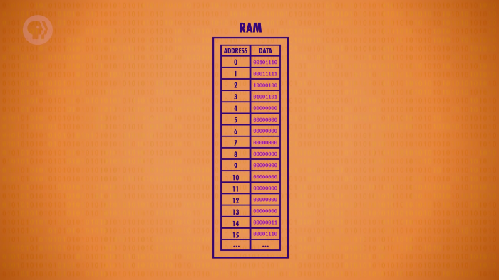

2. 0번 주소의 값을 살펴보자.

- '0010 1110' 이라는 값이 저장되어 있다.
- 명령 코드 '0010' 은 'LOAD_A' 를 나타낸다.
- 메모리 위치 '1110' 은 14번 주소를 나타낸다.

3. 이 값을 명령어의 내용으로 바꿔서 생각해보자.

- '00101110' 보다 읽기도 쉽고, 한 눈에 알아볼 수 있다.

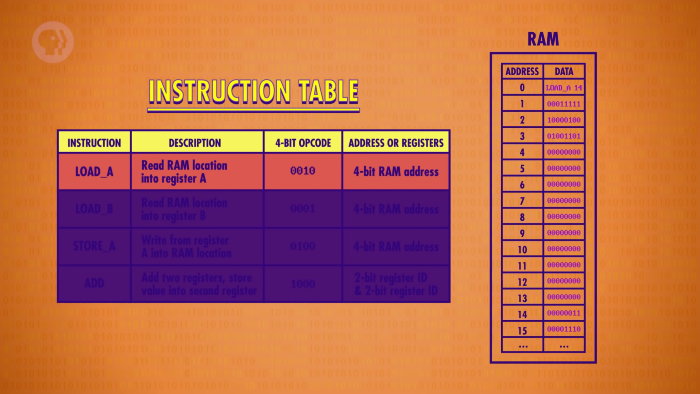

4. 나머지 위치의 값들도 바꿔보자.

- 이렇게 4개의 명령어로 구성된 프로그램과 3, 14라는 숫자가 저장되어 있다.

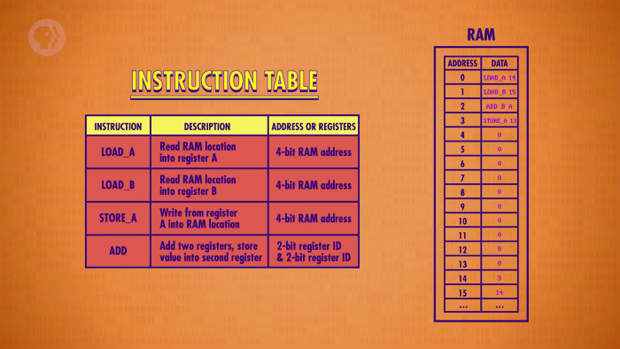

 

이제, 프로그램을 차근차근 실행해보자.

1. 첫번째 명령어 'LOAD_A 14' 를 실행한다.

- 14번 주소의 값 3을 레지스터A에 읽어들인다.

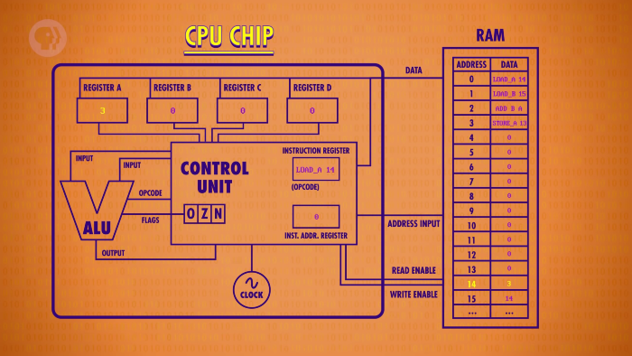

2. 다음 명령어인 'LOAD_B 15' 를 실행한다.

- 15번 주소의 값 14를 레지스터B에 읽어들인다.

3. 다음 명령어인 'ADD B A' 를 실행한다.

- 이번에는 더하기 연산을 수행해야 하기 때문에, ALU를 이용한다.
- 두 개의 레지스터에 있는 값을 지정하여 연산을 진행한다.
- 결과 값은 2번째로 지정된 레지스터인 A에 저장된다.

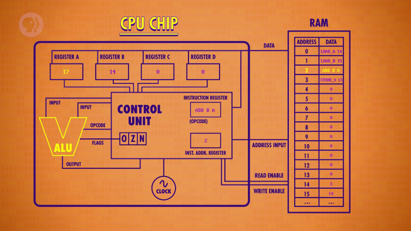

4. 마지막 명령어인 'STORE_A 13' 을 실행한다.

- 이번에는 레지스터A에 있는 값을 13번 주소에 써넣는다.

 

이렇게 2개의 숫자를 더하는 프로그램을 실행해봤다.

# 2. 명령어 추가하기

이렇게, 간단한 명령어 4가지로 동작하는 프로그램을 실행해봤다.

더 다양한 프로그램을 구성할 수 있도록, 명령어를 몇 개 추가해보자.

## 2-1. 뺄셈 명령어

덧셈 명령어(ADD) 와는 반대로, 뺄셈 명령어(SUB) 를 추가해보자.

- 명령어 : SUB(subtract)
- 설명 : 두 개의 레지스터에 저장된 값을 빼고, 두 번째 레지스터에 값을 써넣는다.
- 주소 혹은 레지스터 : 2비트 레지스터 ID, 2비트 레지스터 ID

## 2-2. 점프 명령어

이번엔 점프(JUMP) 라는 새로운 명령어를 추가해보자.

- 명령어 : JUMP
- 설명 : 명령어 주소 레지스터를 새로운 주소로 변경한다. (주소로 점프한다.)
- 주소 혹은 레지스터 : 4비트 메모리 주소

 

**특징을 정리하면 아래와 같다.**

- 추상화 계층에 따라서 동작 방식을 다르게 표현할 수 있다.
   - 고수준 : 이름 그대로 프로그램을 새로운 위치로 점프시킨다.
   - 저수준 : 명령어 주소 레지스터에 값을 덮어쓰는 동작을 수행한다.
- 명령 순서를 변경하거나, 일부 명령을 건더뛰고자 할 때 유용하게 사용된다.
- 예를 들어, 'JUMP 0' 명령어를 실행하면 0번 주소로 이동하게 된다.  
  `(= 프로그램이 처음부터 다시 실행된다.)`

## 2-3. 조건부 점프 명령어

이번엔 특별한 형태의 점프 명령어(JUMP_NEGATIVE) 를 추가해보자.

- 명령어 : JUMP_NEGATIVE
- 설명 : ALU의 결과가 음수(negative) 면, 명령어 주소 레지스터를 새로운 주소로 변경한다.
- 주소 혹은 레지스터 : 4비트 메모리 주소

 

**연산 결과의 상태에 따라 다른 동작을 수행한다.**

- 연산의 결과가 음수인 경우, 지정된 위치로 점프한다.
- 연산의 결과가 0 혹은 양수인 경우, 다음 명령을 수행한다.

 

> 

'5. 컴퓨터는 어떻게 계산할까? - ALU편' 복습

> 
> - ALU는 연산의 결과 상태를 표시하기 위해 '플래그(flag)' 정보를 출력한다.
> - 'Negative' 플래그는 연산의 결과가 음수인 경우에 출력되는 플래그다.
> 
> 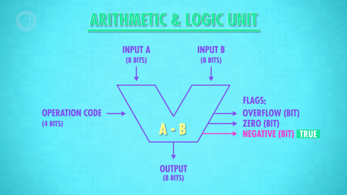
> 

## 2-4. 중지 명령어

마지막으로, 작업 중단 시점을 알려주는 중지 명령어(HALT) 를 추가해보자.

- 명령어 : HALT
- 설명 : 프로그램을 마치고, 컴퓨터를 정지시킨다.
- 주소 혹은 레지스터 : 없음

 

**중지 명령어가 필요한 이유**

1. 처리하고자 하는 작업만 컴퓨터가 수행하도록 하기 위해서
   - 

'1. 두 수를 더하는 프로그램' 의 경우

  
      1. 마지막 명령어인 'STORE_A 13' 을 실행한다.
      2. 바로 다음 주소의 값인 '00000000' 을 실행한다.
      3. '0000' 에 해당하는 명령 코드가 없기 때문에 문제가 발생한다.
    
      `따라서, 기존의 프로그램은 아래 사진처럼 수정되어야 한다.`
      
      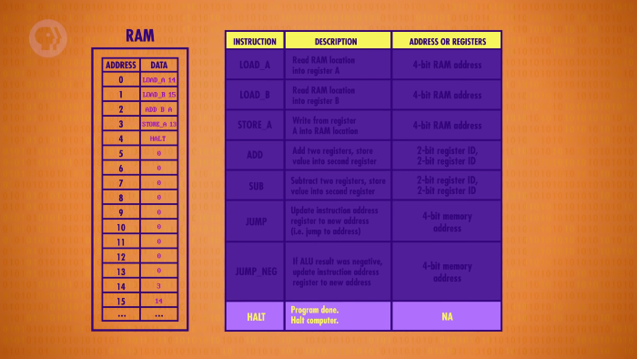
   

2. 명령어와 정보가 저장되는 구역을 구분해주기 위해서
   - 명령어와 정보는 모두 같은 기억 장치에 저장된다.  
   - 둘 다 2진수 정보이기 때문에 컴퓨터는 이들을 구분지을 수 없다.

> 

클릭하여, 이번 수업에서 사용할 모든 명령어가 정리된 표를 확인해보자.

> 
> | 명령어 | 설명 | 주소 혹은 레지스터 |
> |-|-|-|
> | LOAD_A | RAM 위치를 레지스터 A로 읽어들인다. | 4비트 RAM 주소 |
> | LOAD_B | RAM 위치를 레지스터 B로 읽어들인다. | 4비트 RAM 주소 |
> | STORE_A | 레지스터의 값을 RAM 위치로 써넣는다. | 4비트 RAM 주소 |
> | ADD | 두 개의 레지스터에 저장된 값을 더하고, 두 번째 레지스터에 값을 써넣는다. | 2비트 레지스터 ID, 2비트 레지스터 ID |
> | SUB | 두 개의 레지스터에 저장된 값을 빼고, 두 번째 레지스터에 값을 써넣는다. | 2비트 레지스터 ID, 2비트 레지스터 ID |
> | JUMP | 명령어 주소 레지스터를 새로운 주소로 변경한다. (주소로 점프한다.) | 4비트 메모리 주소 |
> | JUMP_NEG | ALU의 결과가 음수(negative) 면, 명령어 주소 레지스터를 새로운 주소로 변경한다. | 4비트 메모리 주소 |
> | HALT | 프로그램을 마치고, 컴퓨터를 중지시킨다. | 없음 |
> 

# 3. 점프가 사용되는 프로그램

이번에는 'JUMP' 명령어가 사용되는 프로그램을 살펴보자.

클릭하여, 프로그램과 정보를 살펴보자.

- 두 수를 더하는 프로그램을 약간 변형할 것이다.
- 'STORE_A 13' 명령의 다음 위치에 'JUMP 2' 명령을 추가한다.
- 기억 장치에 저장된 정보를 둘 다 1로 수정한다.

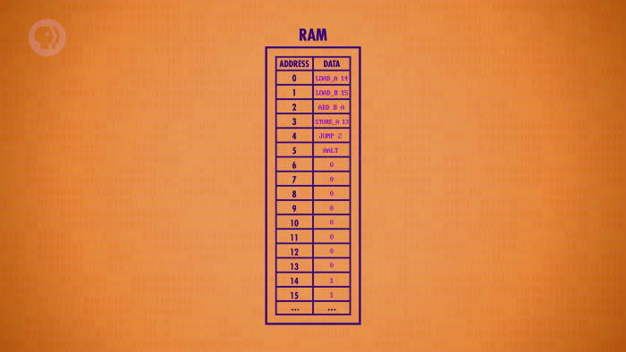

 

1. 첫번째 명령어 'LOAD_A 14' 를 실행한다.

- 14번 주소의 값 '1' 을 레지스터A에 읽어들인다.

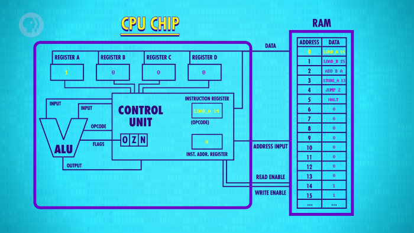

2. 다음 명령어인 'LOAD_B 15' 를 실행한다.

- 15번 주소의 값 '1' 을 레지스터B에 읽어들인다.

3. 다음 명령어인 'ADD B A' 를 실행한다.

- 레지스터B의 값 1과 레지스터A의 값 1을 더한다. `(1 + 1 = 2)`
- 결과 값 2는 2번째로 지정된 레지스터인 A에 저장된다.

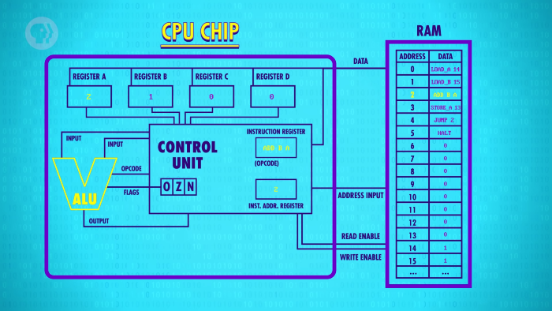

4. 다음 명령어인 'STORE_A 13' 을 실행한다.

- 레지스터A에 있는 값 2를 13번 주소에 써넣는다.

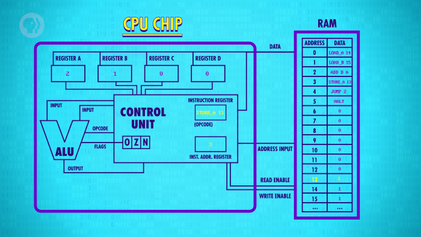

5. 다음 명령어인 'JUMP 2' 를 실행한다.

- 기존의 명령어 주소 레지스터의 값인 4를 2로 덮어쓴다.

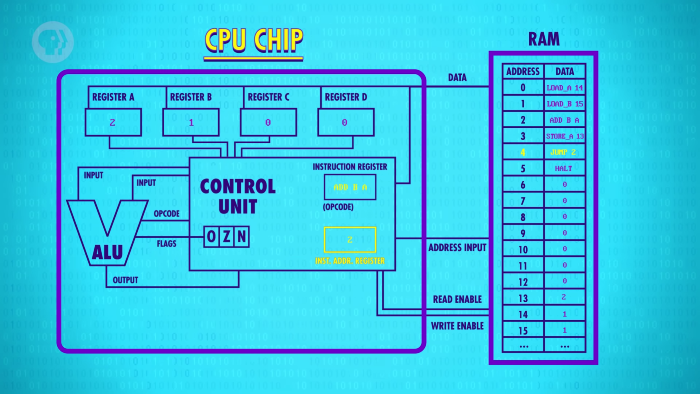

6. 다음 명령어인 'HALT' 대신, 2번 주소의 'ADD B A' 를 실행한다.

- 레지스터B의 값 1과 레지스터A의 값 2를 더한다. `(1 + 2 = 3)`
- 결과 값 3은 2번째로 지정된 레지스터인 A에 저장된다.

7. 다음 명령어인 'STORE_A 13' 을 실행한다.

- 레지스터A에 있는 값 3을 13번 주소에 써넣는다.

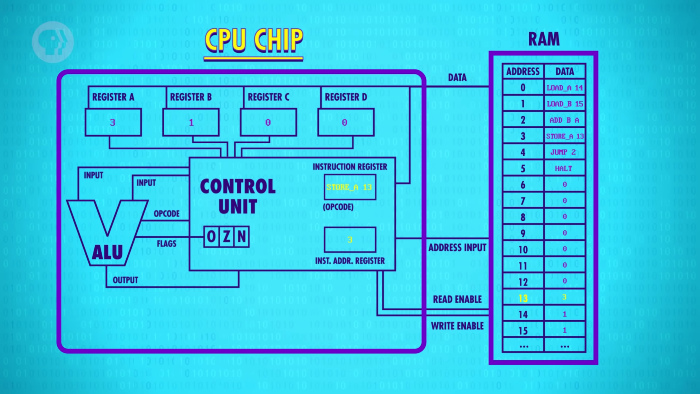

8. 다시, 'JUMP 2' 를 실행하고, 'ADD B A' 를 실행한다.

- 레지스터B의 값 1과 레지스터A의 값 3을 더한다. `(1 + 3 = 4)`
- 결과 값 4는 2번째로 지정된 레지스터인 A에 저장된다.

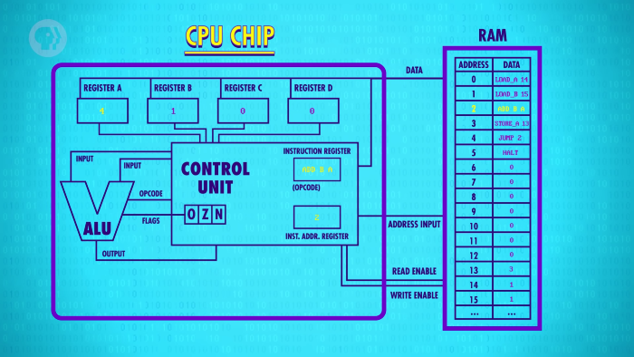

 

이렇게, 1씩 더하는 작업을 반복적으로 수행하게 된다.

> 차례대로 숫자를 세는 프로그램이라고도 할 수 있다.

# 4. 무한 루프와 조건부 점프

위에서 살펴본 프로그램에는 문제가 있다.

- 프로그램이 실행되는 과정에서 항상 'JUMP' 명령어를 수행하게 된다.
- 따라서, 바로 다음 명령어인 'HALT' 에 도달할 수 없게 된다.

이렇게 프로그램의 종료 명령을 수행하지 못하고,  
끝없이 동작하는 것을 **무한 루프(infinite loop)** 라고 한다.

 

이 때, 무한 루프를 빠져나가려면, **조건부 점프(conditional jump)** 가 필요하다.

- 말 그대로, '특정 조건이 충족될 경우에만 발생하는 점프' 다.
- 아까 살펴본 'JUMP_NEGATIVE' 명령어가 그 예시다.
- 물론, 'JUMP\_IF\_EQUAL', 'JUMP\_IF\_GREATER' 등 다른 형태도 있다.

# 5. 조건부 점프가 사용되는 프로그램

이번에는 조건부 점프를 활용하는 프로그램을 살펴보자.

1. 첫번째 명령어 'LOAD_A 14' 를 실행한다.

- 14번 주소의 값 11을 레지스터A에 읽어들인다.

2. 다음 명령어 'LOAD_B 15' 를 실행한다.

- 15번 주소의 값 5를 레지스터A에 읽어들인다.

3. 다음 명령어 'SUB B A' 를 실행한다.

- 레지스터A의 값 11에서 레지스터B의 값 5를 뺀다. `(11 - 5 = 6)`
- ALU의 출력 결과는 6, 즉 양수이므로 'Negative' 플래그는 비활성화 상태다.
- 결과 값 6은 2번째로 지정된 레지스터인 A에 저장된다.

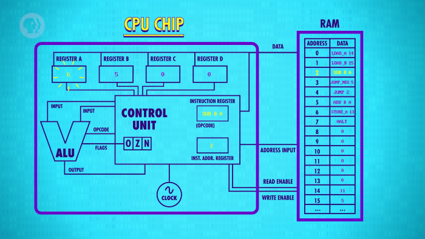

4. 다음 명령어인 'JUMP_NEG 5' 를 실행한다.

- 조건이 충족되지 않았으므로, 점프 명령을 수행하지 않는다.

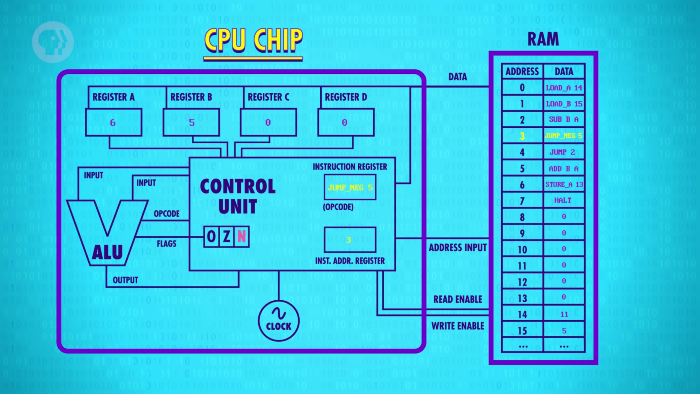

5. 다음 명령어인 'JUMP 2' 를 실행한다.

- 기존의 명령어 주소 레지스터의 값인 4를 2로 덮어쓴다.

6. 2번 주소의 'SUB B A' 를 실행한다.

- 레지스터A의 값 6에서 레지스터B의 값 5를 뺀다. `(6 - 5 = 1)`
- ALU의 출력 결과는 1, 즉 양수이므로 'Negative' 플래그는 비활성화 상태다.
- 결과 값 1은 2번째로 지정된 레지스터인 A에 저장된다.

7. 다음 명령어인 'JUMP_NEG 5' 를 실행한다.

- 조건이 충족되지 않았으므로, 점프 명령을 수행하지 않는다.

8. 다음 명령어인 'JUMP 2' 를 실행한다.

- 기존의 명령어 주소 레지스터의 값인 4를 2로 덮어쓴다.

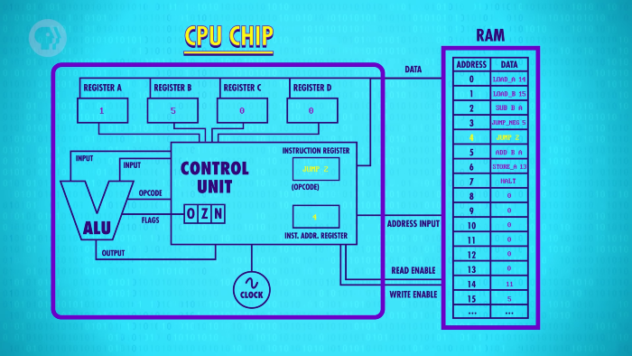

9. 2번 주소의 'SUB B A' 를 실행한다.

- 레지스터A의 값 1에서 레지스터B의 값 5를 뺀다. `(1 - 5 = -4)`
- ALU의 출력 결과가 음수인 -4가 되었으므로 'Negative' 플래그가 활성화된다.
- 결과 값 -4는 2번째로 지정된 레지스터인 A에 저장된다.

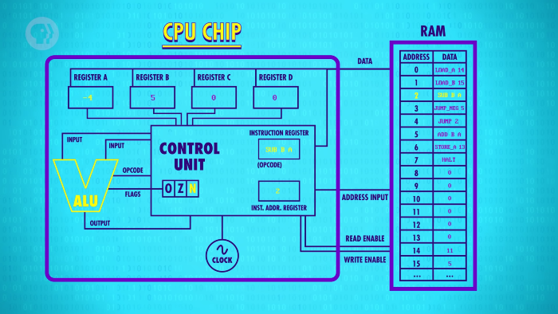

10. 다음 명령어인 'JUMP_NEG 5' 를 실행한다.

- 조건이 충족되었기 때문에, 점프 명령을 수행하게 된다.

`이렇게 무한 루프(이 경우에는 반복 과정) 에서 빠져나왔다!`

11. 5번 주소의 'ADD B A' 를 실행한다.

- 레지스터B의 값 5과 레지스터A의 값 -4을 더한다. `(5 + -4 = 1)`
- 결과 값 1은 2번째로 지정된 레지스터인 A에 저장된다.

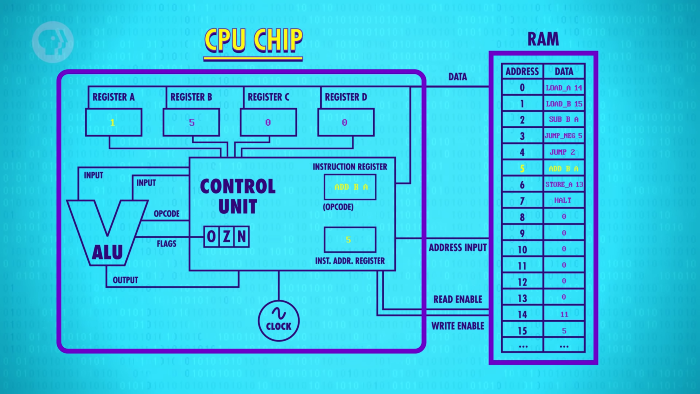

12. 다음 명령어인 'STORE_A 13' 을 실행한다.

- 레지스터A에 있는 값 1을 13번 주소에 써넣는다.

13. 다음 명령어인 'HALT' 를 실행한다.

- 프로그램을 마치고, 컴퓨터를 중지키신다.

 

이렇게, 무한 루프에 걸리지 않고, 프로그램이 종료된다.

- 7개의 명령어로 구성되었지만, 반복 실행으로 인해 CPU는 총 13번 동작했다.
- 위에서 살펴본 동작은 11에서 5를 나눈 후에, 나머지 1을 얻는 과정과 같다.
- 명령어를 조금 추가하면, 반복 회수를 세어 몫도 구할 수 있다.

# 6. 소프트웨어의 활용

**위에서 살펴본 프로그램의 특징을 정리해보면 아래와 같다.**

- 5와 11 대신, 다른 값을 넣어도 문제없이 작동한다. `(7과 81, 18과 54 등)`
   - 이렇게, 소프트웨어는 다양한 상황에서 동작할 수 있다는 강점이 있다.
- ALU가 지원하지 않는 나누기 연산도 프로그램을 통해 구현할 수 있다.
   - 이렇게, 소프트웨어를 통해 하드웨어의 한계를 극복할 수도 있다.

 

또, 이런 프로그램들로 더 다양한 기능을 수행하는 프로그램을 구성할 수도 있다.

이렇게 소프트웨어의 특징까지 살펴봤으니, 더 높은 추상화 계층으로 이동해보자.

# 7. 명령어의 구성

우리는 8비트 명령어를 지원하는 아주 기본적인 CPU를 구성해봤다.

이 명령어는 명령 코드와 위치 지정에 각각 4비트를 사용했는데,  
당연하게도, 4비트로 표현 가능한 값에는 한계가 있다.

- CPU가 처리 가능한 명령은 최대 16가지다.
- 지정할 수 있는 메모리 위치는 최대 16군데다.
- 16번 주소로는 점프할 수 없다.  
  `(다음 주소인 17을 4비트로 표현할 수 없기 때문)`

 

현대의 CPU들은 이런 한계를 극복하기 위해 2가지 전략을 사용한다.

1. 단순하게 명령어의 길이(instruction length) 를 늘린다.
   - 32비트나 64비트 등 더 큰 단위를 사용한다.
2. 명령어마다 서로 다른 길이를 갖도록 구성한다.

 

**<작성 중인 글입니다.>**

**<아래 내용은 정리 중입니다.>**

# 8. 가변 길이 명령어와 즉시 값

위에서 살펴봤듯, 명령어마다 작업을 수행하는데 필요한 정보가 다르다.

- 별다른 추가 정보 없이 동작할 수 있는 중지 명령어
- 기억 장치의 특정 주소값을 사용하는 점프 명령어
- 기억 장치나 레지스터에 저장된 값을 사용하는 덧셈, 뺄셈 명령어

이렇게, 명령에 필요한 구성이 다르기 때문에 명령어의 길이도 다르게 할 수 있는데,  
이런 구성의 명령어들을 **가변 길이 명령어(variable length instruction)** 라고 한다.

> CPU에 적용되면 '가변 길이 명령어 형식을 사용한다' 라고 표현한다.

 

또, 점프 명령어 처럼 명령어에 표기된 정보를 직접적으로 사용하는 경우도 있는데,  
이렇게 기억 장치나 레지스터에 저장되지 않은 명령어에 표기되는 값을 

또, 작업에 필요한 정보가 기억 장치나 레지스터에 저장된 값이 아니라서,  
명령 코드 뒤에 특정 정보를 직접적으로 표기하는 경우도 있다.

 

또, 명령어는 명령 코드 이외에도 다른 값들로 구성되어 있기도 한데,  
기억 장치에 저장된 값이 아닌, 명령어 자체에 포함된 값을 사용하는 경우도 있다.

또, 명령 수행에 필요한 정보가 명령어에 직접적으로 포함되는 경우도 있는데,  
이렇게 명령어 자체에 포함된 정보를 **즉시값(Immediate Value)** 이라고 한다.

> 기억 장치나 레지스터에 저장된 값을 사용하지 않는다는 것이 특징이다.

기억 장치 주소가 필요없는 중지 명령와 같은 명령의 경우

중지 명령처럼 추가적인 값이 필요 없는 명령어의 경우 즉시 실행할 수 있지만,  
기억 장치 주소가 필요한 점프 등의 명령은 명령 코드 뒤의 주소까지 가져와야 한다.

메모리에 저장된 값을 사용하지 않고, 명령어 자체에 포함된 값을 **즉시값(Immediate Value)** 이라고 한다.

CPU를 이런 식으로 설계하면 다양한 길이의 명령어를 처리할 수 있지만,  
인출 단계를 수행하는 과정이 더 복잡해진다.

 

두번째 방법은 명령어 길이를 가변하는 것이다.

예를 들어 CPU가 8비트 명령 코드를 사용한다고 해보자.

추가 정보가 필요없는 HALT 같은 명령어를 만나면, CPU는 즉시 실행할 수 있다.

허나, JUMP 와 같은 명령어를 만나면 CPU는 점프할 주소를 또 읽어와야 한다.

그래서, 메모리에서 JUMP 명령어 뒤에 저장된 값을 즉시 읽어온다.

이것을 'Immediate Value' 라고 한다.

이런 프로세서를 설계하면, 명령어의 길이는 몇 바이트라도 만들 수 있지만,  
CPU의 인출 단계가 좀 더 복잡해질 것이다.

# 9. 실제 CPU 살펴보기

우리의 예제 CPU와 명령어 집합은 가상의 것이었지만,  
주요한 기본 원칙을 설명할 수 있도록 설계되었다.

이제 실제 CPU의 예제를 살펴볼 것이다.

1971년, Intel 은 4004 프로세서를 출시했다.

이것은 모든 기능을 단일 칩에 넣은 최초의 CPU이고,  
오늘날 우리가 알고 있고 사랑하고 있는 Intel 프로세서의 기반을 닦은 칩이다.

여기 보이듯이 46개의 명령어를 지원하고, 이것은 컴퓨터가 하는 모든 일들을 만드는데 충분하다.

우리가 지금까지 설명한 JUMP, ADD, SUBTRACT, LOAD 와 같은 명령어가 많이 사용된다.

이 CPU는 좀 전에 말했던 것처럼, 많은 메모리 주소를 가리킬 수 있도록  
JUMP 같은 명령어에 8비트 'immediate value' 를 사용한다.

# 10. 마무리

프로세서는 1971년 이후로 긴 여정을 거쳐왔다.

Intel Core i7 과 같은 현대 컴퓨터 프로세서는 수천개의 서로 다른 명령어와 명령어의 변형 형태를 갖고 있다.

길이의 범위도 1바이트에서 15바이트에 이를 정도다.

예를 들어 ADD 의 변형 형태로 10여개 이상의 서로 다른 명령 코드를 갖고 있다.

이렇게 명령어 집합 크기가 거대하게 커짐으로인해 많은 부가 부속품들이 사용된다.

이로 인해, 프로세서를 설계하는 데 오랜 시간이 필요해졌다.

이건 다음 수업에서 이야기해 볼 것이다.
