>
해당 포스트는 
Youtube 채널
<a href='https://www.youtube.com/channel/UCX6b17PVsYBQ0ip5gyeme-Q' target='-blank'>'Crash Course'</a>
에서 제공하는 
<a href='https://www.youtube.com/playlist?list=PL8dPuuaLjXtNlUrzyH5r6jN9ulIgZBpdo' target='-blank'>'Computer Science'</a>
수업을 바탕으로 작성되었습니다.  
( 사진 속 인물은
<a href='https://about.me/carrieannephilbin' target='-blank'>'Carrie Anne Philbin'</a>
선생님 입니다! )

# 0. 시작하기에 앞서,

지금까지의 수업에서 우리는 초당 1개의 계산을 처리하는 기계 장치가  
KHz, MHz 속도로 작동하는 CPU로 발전하기 까지의 과정을 살펴봤다.

> 요즘 사용되는 장치들은 초당 수십억 개의 명령을 실행하는 GHz 속도로 실행되고 있다.

 

전자식 컴퓨터가 등장하고, 초기에는 프로세서의 속도를 높이기 위해,  
논리 회로, ALU 등을 구성하는 트랜지스터의 신호 전환 속도를 개선했었다.

하지만, 트랜지스터를 빠르고 효율적이게 만드는 것만으로는 한계가 있었기 때문에,  
프로세서 설계자들은 성능을 비약적으로 향상시킬 수 있는 다양한 기술들을 개발해왔다.

> 덕분에, 단순한 명령을 더 빠르게 수행하는 것뿐만 아니라, 훨씬 더 정교한 작업도 수행할 수 있게 되었다.

# 1. 성능과 복잡성

지난 수업에서 우리는 두 숫자의 뺄셈을 반복하여 나눗셈하는 프로그램을 만들었다.  

> '16 / 4' 를 여러 작은 문제로 나눠, 16이 0보다 작아질 때까지 4를 빼는 방식

하지만, 이런 방식은 클럭이 많이 회전해야 해서 비효율적이기 때문에,  
오늘날의 프로세서들은 대부분 나누기 기능을 지원하는 ALU를 탑재하고 있다.

나눗셈 회로가 탑재되면서 ALU의 크기는 커지고 구성도 복잡해졌는데,  
이런 '성능과 복잡성의 거래' 는 컴퓨터의 역사 속에 많이 존재했다.

## 1-1. 기능의 추가

더 나아가, 요즘 프로세서들은 복잡한 작업을 전담하는 회로가 탑재되어 있다.

> 표준 동작으로 처리하려면 많은 클럭 회전이 필요한 작업을 예로 들 수 있다.
> - 그래픽 작업, 비디오 디코딩, 파일 암호화 등

게임이나 암호화 등의 추가 기능을 수행하는 회로가 탑재된 프로세서도 있다.  
`(MMX, 3DNow, SSE 와 같은 용어를 들어본 적 있을 것이다.)`

## 1-2. 하위 호환성

이렇게 기능의 확장과 함께 명령어 집합의 규모도 점점 커졌지만,  
이미 작성된 프로그램들이 존재했기에 기능을 삭제하기도 힘들었다.

결국, 명령어 집합의 규모는 기존에 있던 기능들을 유지하며 계속 커지기만 했다.

이 때, 이전 제품의 기능을 그대로 사용할 수 있는 성질을  
**'하위 호환성(backwards compatibility)'** 이라고 한다.

>
최초의 CPU인 Intel 4004 의 경우, 총 46개의 명령어만 사용했지만,  
요즘 프로세서들은 수천 가지 명령어를 처리할 수 있도록 구성되어 있다..

# 2. 데이터 버스

높은 클럭 속도와 확장된 명령어 집합을 또 다른 문제를 일으켰는데,  
바로 정보의 입/출력 속도가 CPU의 동작 속도를 따라가지 못한다는 것이었다.

>
엄청 빠른 증기 기관차가 있어도 석탄 싣는 속도가 느린 것과 비슷한데,  
이 상황을 컴퓨터에 비유했을 때, 병목 지점은 'RAM' 이라고 할 수 있다.

RAM은 보통 CPU 외부에 위치하기 때문에 정보 선이 연결되어 있는데,  
정보가 왔다갔다하는 통로 역할을 해서 이 선을 **'버스(Bus)'** 라고 부른다.

클릭하여, 연결 상태를 그림으로 살펴보자.

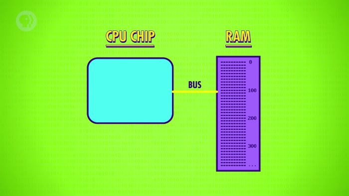

# 3. 캐시

버스의 길이가 아무리 짧고 전기 신호가 빛 수준의 속도로 이동한다고 해도,  
초당 10억개의 신호가 발생하는 GHz 단위에서는 아주 작은 지연도 문제가 된다.

주소 확인, 정보 검색, 출력 준비 등 RAM의 동작에도 시간이 필요하기 때문에,  
'RAM에서 정보 읽어오기' 명령 수행 중에 수십 번의 클럭 회전이 있을 수 있고,

이 시간 동안 프로세서는 데이터를 기다리며 대기할 수 밖에 없게 된다.

 

이런 문제는 작은 RAM 조각을 CPU에 넣어둠으로써 해결할 수 있는데,  
이렇게 CPU 내부에 있는 임시 기억 장치를 **'캐시(Cache)'** 라고 한다.

>
프로세서 칩의 공간이 좁기 때문에, 대부분의 캐시는 KB, MB 크기로 구성된다.  
`(GB 단위인 RAM에 비하면 확실히 작은 규모다.)`

클릭하여, 그림으로 살펴보자.

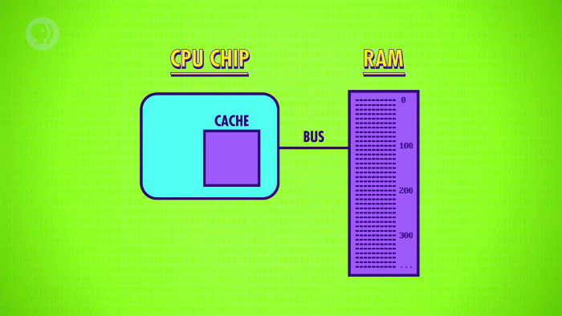

## 3-1. 원리

캐시를 활용하면 컴퓨터의 작업 속도를 현명하게 높일 수 있는데,  
CPU가 RAM에서 정보를 읽어올 때의 상황을 예시로 살펴보자.

RAM에서 CPU가 요청한 정보 하나만 읽어오는 것 대신,  
해당 정보가 포함된 블록 전체를 캐시에 읽어들이도록 할 수 있다.

클릭하여, 동작을 살펴보자.

 

물론, 정보 하나를 읽어오는 것보다는 시간이 조금 더 걸리겠지만,

컴퓨터 정보는 순차적으로 배열되고 처리되는 경우가 많기 때문에  
이 방법은 대부분의 경우에 매우 효율적이라고 할 수 있다.

## 3-2. 효율성

컴퓨터를 이용해 식당의 일일 총 매출을 계산하는 상황을 가정해보자.

1. 기억 장치의 100번 위치에 있는 첫 거래 정보를 인출하는 것으로 시작한다.

- 100번에 해당하는 정보 하나만 불러오는 것이 아니라,  
  100 ~ 200번 주소에 해당하는 정보 블록 전체를 캐시에 읽어들인다.

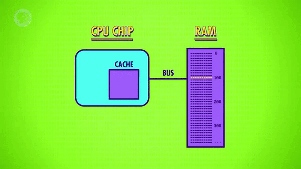

2. CPU는 다음 동작을 수행하기 위해 101번 위치의 정보를 요청한다.

- 이미 캐시에 저장되어 있는 정보이기 때문에, RAM에는 정보를 요청하지 않는다.  
  `(캐시 : 아, 그 값은 이미 여기에 있으니 바로 드릴 수 있습니다!)`

 

이 때, 거리가 매우 가까워서 클럭 회전 1번만에 정보를 제공받을 수 있는데,  
덕분에 CPU는 별도의 대기 시간 없이 바로 동작할 수 있게 된다.

> 이런 작업이 반복될수록, RAM을 사용하는 경우와의 속도 차이가 커진다.

## 3-3. 히트와 미스

CPU가 캐시에서 정보를 가져올 때는 크게 두 가지 상황이 발생한다.

1. 캐시가 요청한 정보를 갖고 있는 경우
2. 캐시가 요청한 정보를 갖고 있지 않은 경우
   
이 때, '1' 의 경우는 캐시 히트, '2' 의 경우는 캐시 미스라고 한다.  
`(hit[필요한 정보를 맞춘], miss[필요한 정보를 놓친] 라니..)`

> #### 강의 영상에는 없는 내용이니 참고만!
전체 요청 중 히트의 비중을 '캐시 적중률(Cache Hit Ratio)' 이라고 하는데,  
캐시 메모리의 성능을 나타내는 하나의 지표이기 때문에 높을수록 좋다.  

## 3-4. 더티 비트

캐시는 계산의 결과를 저장하기도 하는데, 위에서 봤던 식당 예시로 돌아가보자.  

- 길거나 복잡한 계산의 중간 값을 임시로 저장하는 경우에도 사용된다.
- 정보를 쓰는 경우도 읽어올 때와 마찬가지로 캐시가 RAM보다 효율적이다.

 

> 매출 계산을 마쳤고, 그 결과를 150번 위치에 저장하는 상황이라고 가정한다.

이 때, 이전과 마찬가지로 RAM 대신 캐시를 이용해 값을 저장하게 되면  
RAM에 저장된 실제 값과 캐시에 저장된 복사본이 서로 다른 값을 갖게된다.

클릭하여, 위 상황을 살펴보자.

 

이런 상황에서 캐시는 이후에 있을 동기화 작업을 문제없이 수행하기 위해  
블록의 변경 여부를 표시하는 **'더티 비트(Dirty Bit)'** 라는 플래그를 사용한다.

대부분의 동기화는 가득 차있는 캐시에 메모리 블록을 추가할 때 발생하는데,  
더티 비트는 삭제 예정인 블록을 RAM에 덮어써야 하는지 확인하기 위해 사용된다.

클릭하여, 동기화 과정을 살펴보자.

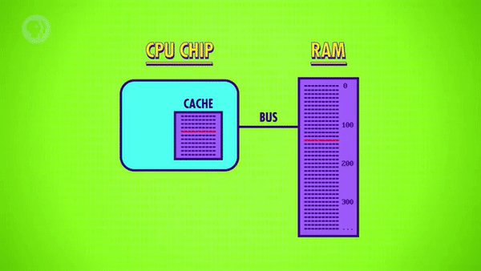

# 4. 명령어 파이프라인

캐시 외에도 CPU 성능을 향상시키는데 사용되는 방법이 있는데,  
바로, **'명령어 파이프라인(Intsruction Pipeline)'** 기법이다.

## 4-1. 순차적 실행

세탁기, 건조기가 각각 한 대씩 있는 호텔의 모든 이불을 세탁한다고 가정해보자.

첫번째로, 모든 작업을 순차적으로 실행하는 방법이 있다.

1. 이불 한 뭉치를 세탁기에 넣고 30분을 기다린다.

2. 젖은 이불들을 건조기에 넣고 다시 30분을 기다린다.

 

이렇게 하면, 한 시간마다 이불 한 뭉치를 세탁할 수 있다.  
`(그나저나, 30분 밖에 안걸리는 건조기라니.. 정말 빠른 속도다..)`

## 4-2. 병렬 처리

이렇게 빠른 건조기를 사용하는 상황에서도 작업 속도를 더 높일 수 있는데,  
바로, 여러 작업을 동시에 **'병렬 처리(Parallel Processing)'** 하는 것이다.

1. 이전 방법처럼 이불 한 뭉치를 세탁기에 넣고 30분을 기다린다.

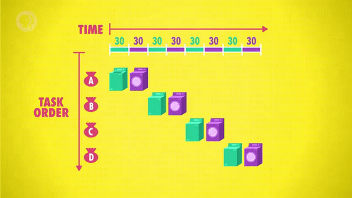

2. 이번에는 젖은 이불들을 건조기에 넣으면서, 세탁기에 다른 이불 뭉치를 넣는다.

- 이렇게 하면, 두 기계가 동시에 작동하게 된다.

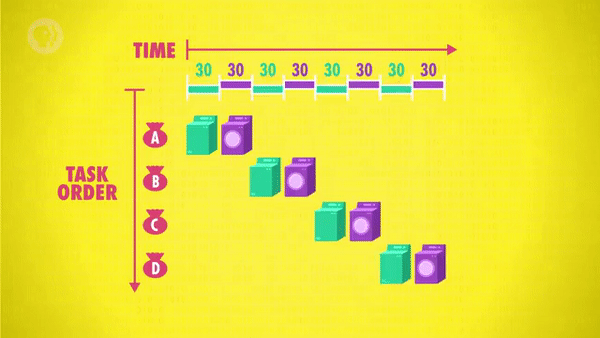

3. 이후, 세탁기, 건조기, 마무리의 과정을 동시에 진행하는 것을 반복한다.

- 매 30분마다, 한 뭉치는 완료, 한 뭉치는 건조, 한 뭉치는 세탁하게 된다.

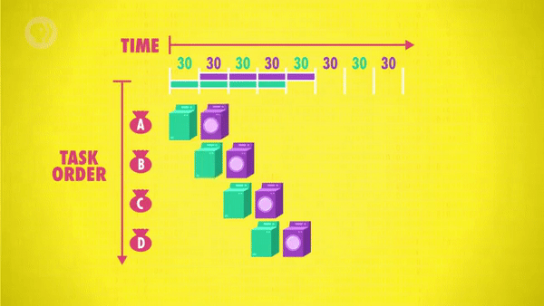

 

이렇게 하면, 같은 시간에 처리할 수 있는 결과를 2배로 늘릴 수 있다.

## 4-3. 파이프라인 설계 적용

프로세서를 설계할 때도 이런 아이디어를 적용할 수 있는데,  
<a href='/Crash-Course/7.-중앙-처리-장치-(cpu)' target='-blank'>
'7. 중앙 처리 장치 (CPU)'</a>
에서 구성했던 프로세서를 예시로 살펴보자.

1. 명령을 처리하기 위해 인출, 해석, 실행의 단계를 거친다.

2. 이와 같은 실행 주기를 반복하면서 작업을 수행해나간다.

- 이런 설계에서, 하나의 명령어를 수행하려면 3번의 클럭 회전이 필요하다.

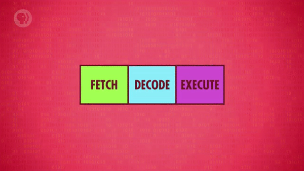

3. 이 때, 각 작업은 서로 다른 부분에서 동작하기 때문에, 병렬 처리할 수 있다.

- 명령이 실행되는 동안 다음 명령어를 해석하고, 그 다음 명령어를 인출한다.

 

- 여러 개별 작업이 동시에 수행되기 때문에, CPU의 모든 부분이 항상 활성화된다.
- 클럭 회전마다 명령이 하나씩 수행되기 때문에, 기존 설계보다 3배 더 빠르다.

이것이 프로세서의 성능을 향상시키는 파이프라인 기법의 원리다.

# 5. 비순차적 실행

캐시와 마찬가지로 파이프라인 기법에서도 까다로운 문제들이 발생할 수 있는데,  
그 중에서도 가장 큰 위험(hazard) 은 명령이 갖는 의존성(dependency) 이다.  
`(정보에 대한 의존성이 가장 문제가 된다.)`

예를 들어, 인출하는 항목이 현재 실행 중인 명령에서 수정될 예정인 경우,  
수정되지 않은 상태의 항목이 파이프라인에 반영되는 상황이 발생하게 되는데,

이를 예방하려면 정보 의존성을 미리 파악하거나, 파이프라인을 지연시킬 수 있어야 한다.

노트북이나 스마트폰 등에 사용되는 고사양 프로세서들은 여기서 더 나아가,

의존성이 있는 명령어들을 동적으로 재정렬하여 지연을 최소화하는  
**'비순차적 실행(Out of Order Execution)'** 이라는 기법을 사용한다.

> #### 강의 영상에는 없는 내용이니 참고만!
파이프라인이 지연되면 CPU의 일부가 작업을 대기하게 되는데,  
이 때, 대기 중인 부분을 활용해 다른 명령을 수행하는 방식이다.  
`(물론, 의존성 문제가 없는 명령을 수행하도록 설계되기 때문에 문제는 없다.)`

당연하게도, 이런 작업들을 처리하려면 회로의 구성이 엄청나게 복잡해지지만,  
그만큼 효과적이기 때문에 오늘날 대부분의 프로세서는 파이프라인 기법을 사용한다.

# 6. 예측 실행과 분기 예측

파이프라인 기법의 또 다른 위험은 조건부 점프 명령이다.

> 지난 수업에서 살펴본 'JUMP_NEGATIVE' 를 예로 들 수 있다.

조건부 점프 명령은 값에 따라서 프로그램의 실행 흐름을 변경하기 때문에,  
단순한 파이프라인이 적용된 프로세서는 결과가 확정될 때까지 대기해야 한다.  

이런 상황에서 파이프라인이 지연되는 시간이 얼마나 길게 갈지 모르기 때문에,  
고성능 프로세서들의 경우 이를 해결할 수 있는 여러 가지 기법이 적용되어 있다.

 

실행 예정인 조건부 점프 명령어를 갈림길의 분기점이라고 가정했을 때,  
고급 CPU는 어떤 길로 갈지 예측하고, 파이프라인에 명령들을 채워놓는다.

이런 기술을 **'예측 실행(Speculative Execution)'** 이라고 한다.

이 때, 예측한 결과가 점프 명령의 결과와 일치하면 지연없이 작업이 수행되지만,  
반대의 경우, 채워뒀던 명령어들을 지우는 **'플러시(Flush)'** 작업을 수행해야 한다.

또, 플러시 작업으로 인한 성능 저하를 최소화하기 위해 CPU 제조사들은  
**'분기 예측(Branch Prediction)'** 이라는 정교한 예측 기술을 개발해왔다.

> 요즘 프로세서의 분기 예측은 90% 이상의 정확도를 지닌다.

# 7. 슈퍼스칼라

파이프라인 기법은 클럭 회전 당 최대 1개의 명령을 수행할 수 있지만,  
실행 단계 중에는 프로세서 전체가 아무것도 하지 않는 경우도 생긴다.

기억 장치의 값을 가져오는 명령에서 ALU는 아무것도 하지 않는 것을 예로 들 수 있는데,  
만약 여러 개의 명령을 한 번에 인출/해석해서 동시에 작업을 처리한다면 어떨까?

- 이 때, 각 명령은 CPU의 서로 다른 부분에서 처리된다.
- 때문에, CPU의 여러 부분을 동시에 활용할 수 있게 된다.
- 따라서, 클럭 회전 당 처리할 수 있는 명령의 수가 늘어난다.

이렇게 동작하도록 설계하는 방식을 **'슈퍼스칼라(superscalar)'** 기법이라고 한다.

- 

 많은 명령을 동시에 처리하도록 파이프라인의 수를 늘리면 된다.

  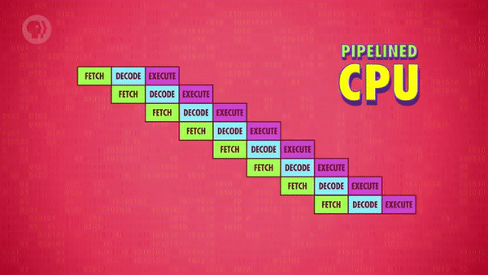
  

- 여기서 더 나아가, 자주 사용되는 명령어들을 위해 중복 회로를 추가할 수도 있다.
   - 예를 들어, ALU의 개수를 늘려서 여러 연산 작업을 병렬로 수행할 수도 있다.

# 8. 멀티 코어

지금까지 살펴본 기술들은 명령 수행량의 최적화에 초점을 맞췄지만,  
명령 수행 단위를 여러 개로 늘리는 방법으로도 성능을 향상시킬 수 있다.

CPU의 '명령 수행 단위(processing unit)' 를 '코어(core)' 라고 하기 때문에,  
이런 구성을 **'멀티 코어 프로세서(Multi-Core Processor)'** 라고 한다.

- 

클릭하여, 멀티 코어의 구성을 간단하게 살펴보자.

  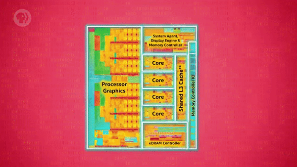
  

- 

듀얼 코어, 쿼드 코어와 같은 표현들을 들어본 적 있을 것이다.

  
  - 이렇게, 하나의 CPU 칩에 독립된 처리 장치가 여러 개 있다는 것을 의미한다.

  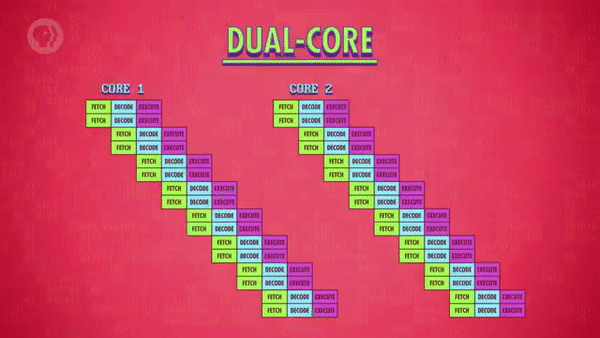
  
  

 

캐시와 같은 자원을 공유해 여러 코어가 작업을 나눠서 수행하는 등,  
단순히 여러 개의 CPU를 사용하는 방식과는 확연한 차이가 있다.

# 9. 슈퍼 컴퓨터

요즘에는 흔한 듀얼 코어, 쿼드 코어로도 성능이 부족할 때가 있는데,  
이런 경우에는 하나의 컴퓨터에 여러 개의 CPU를 사용할 수도 있다.

> 유튜브 서버는 수백 명이 동시에 시청해도 끊기지 않을 정도의 성능이 필요하다.

결국 인간은 더 좋은 성능을 갈망했고, <b>슈퍼 컴퓨터(Super Compter)</b> 를 만들게 되었다!

 

우주의 형성 과정을 시뮬레이션하는 등의 `(괴물 같은)` 계산을 수행하려면,  
엄청난 수준의 컴퓨팅 파워가 필요할 텐데, 프로세서 몇 개 가지고는 턱도 없을 것이다..

 

참고로, 이 수업의 강의 영상이 만들어진 2017년 기준으로 세계에서 가장 빠른 컴퓨터는,  
중국 우시의 'National Supercomputing Center' 에 있는 'Sunway Taihulight' 이었다.  
`(이 글에선 '선웨이 타이후 라이트' 라고 부를 것이다.)`

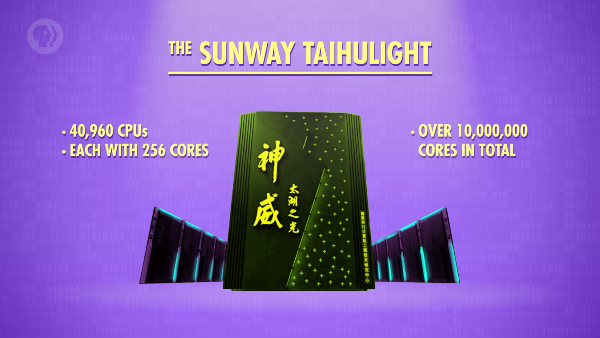

선웨이 타이후 라이트는 256개의 코어를 가진 CPU 40,960개로 구성되어 있는데,  
총 1000만 개가 넘는 코어 전체가 1.45GHz 의 클럭 속도로 동작한다.

성능을 다른 단위로 표현하면 9300조(9,300,000,000,000,000) 플롭스라고 할 수 있다.  
`(이 정도 속도로 작동한다니, 정말 파멸적인 성능이다..;;)`

> 여기서 **'플롭스(FLOPS)'** 는 컴퓨터의 성능을 수치로 나타낼 때 주로 사용되는 단위다.
> - 'Floating point Operations Per Second'(초당 부동소수점 연산) 이다.
> - 컴퓨터가 1초 동안 수행할 수 있는 부동소수점 연산의 횟수가 기준이다.

# 10. 마무리

지금까지 내용을 요약하자면, 컴퓨터 프로세서는 훨씬 더 빠르고 정교해졌을 뿐 아니라,  
클럭 당 더 많은 계산을 수행할 수 있도록 하기 위해 온갖 기법이 동원되었다고 할 수 있다.

우리의 일은 이런 엄청난 성능을 이용해 멋있고 유용하게 사용하는 것이다.

그것이 프로그래밍의 본질이고, 이 부분은 다음 수업에서 다뤄볼 예정이다.

 

**<작성 중인 글입니다.>**

**<아래 내용은 정리 중입니다.>**

# 배운 점, 느낀 점

컴퓨터의 성능을 비약적으로 향상시키는 다양한 기술들을 배웠고,  
이런 내용들을 연구하고 개발한 컴퓨터 과학자들의 위대함을 느낄 수 있었다.

이런 노력들 덕분에 우리가 이렇게 편리한 세상에서 살게 되었다는 것을 깨달았다.

## 1.

- 이전 제품의 기능을 그대로 사용할 수 있는 성질인 하위호환성
- 컴퓨터 내에서 정보가 왔다갔다하는 데 사용되는 회로인 버스
- 프로세서 내부에 있는 작은 임시 기억 장치인 캐시
- 캐시가 활용된 여부를 표현하는 용어인 캐시 히트와 캐시 미스
- 기억 장치와 캐시에 있는 복사본의 차이 여부를 표시하는 더티 비트

## 2.

- 병렬 처리를 통해 명령 수행의 효율성을 높이는 파이프라인 기법
- 의존성에 따라 명령어를 동적으로 재정렬하는 비순차적 실행 기법
- 조건부 점프 명령의 결과를 예측해 미리 명령을 수행하는 예측 실행
- 예측이 실패하는 경우를 최소화하기 위한 정교한 기술인 분기 예측

## 3.

- 파이프라인의 수를 늘려 동시에 많은 명령을 수행하도록 하는 슈퍼스칼라 기법
- CPU의 명령 수행 단위인 코어를의 개수를 늘리는 구성인 멀티 코어
- 인간의 욕심으로 탄생한 파멸적 성능의 컴퓨터인 슈퍼컴퓨터
- 컴퓨터 성능을 수치로 표현하는 단위인 플롭스
