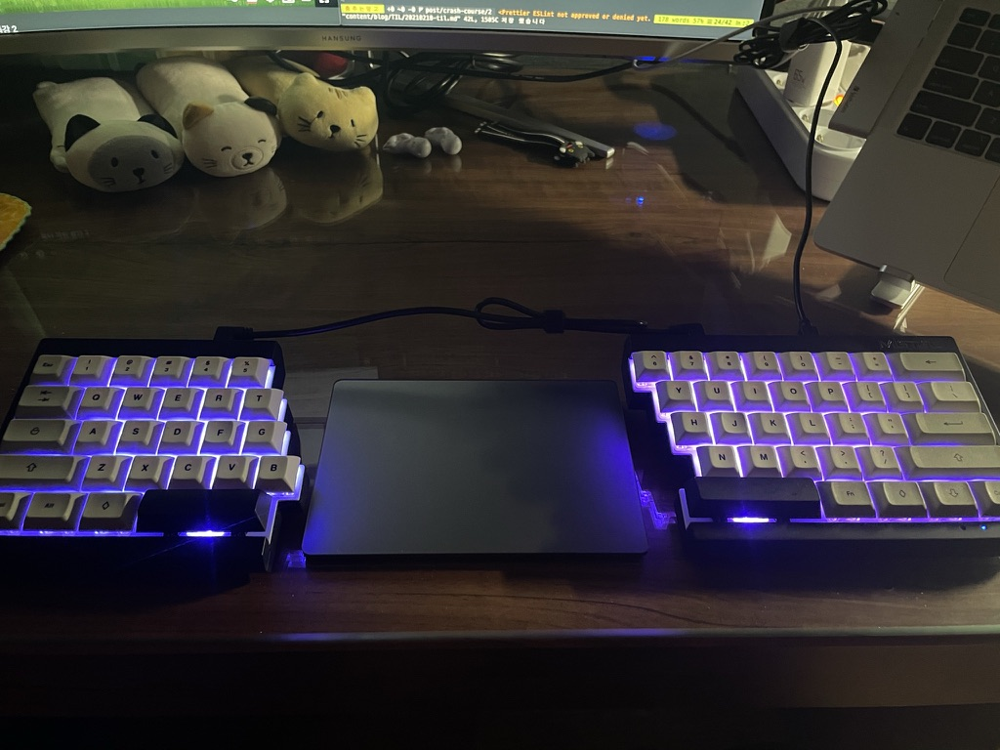

# 오늘 한 일

- Crash Course 내용 정리
   - 드디어, '2' 의 내용을 마무리지었다.
- AN/FSQ-7 과 SAGE 에 대해 알아봤다.
   - 컴퓨팅 장치의 한계를 극복하기 위해 스펙을 늘리던 이전까지의 역사와는 다르게,  
     규모를 늘리는 방식을 채택한 사례라는 것을 알게됐다.
   - Scale-Up 과 Scale-Out 의 개념이 떠올랐다.
- 'Solid-State' 에 대해 알아봤다.
   - 반도체 물질을 기반으로 하는 전기 작용 장치라는 뜻으로 이해했다.
   - 오늘날에 반도체라고 부르는 것과 집적회로를 가리키는 표현이라는 것을 알게됐다.
   - SSD 가 'Solid State Drive' 의 준말이라는 것을 알게됐다.
- A/S 맡긴 키보드가 드디어 왔다!
<details><summary>손목통증, 이제 안녕!</summary>

  
</details>

# 생각 정리

- AN/FSQ-7 을 보고 미국의 별명이 왜 '천조국' 인지, 다시 한 번 깨달았다.  
   ```
   1. 하루에 절반은 고장나 있다
   2. 군사 목적이라서 24시간 운용되어야 한다.
   3. 그럼 컴퓨팅 장치를 2대로 늘려서 교대로 운용하자(?!)

   필요에 의한 선택이였겠지만, 정말로 대단하다;;
   ```

# 내일 할 일

- Crash Course 내용 정리
   - '2' 의 '배운 점, 느낀 점' 마무리 짓기
   - '1' 재구성하기
   - '3' 내용 받아적어두기

<br>

- 20210418 - 맞춤법 수정(운용되야한다 -> 운용되어야 한다, 한번 -> 한 번)
