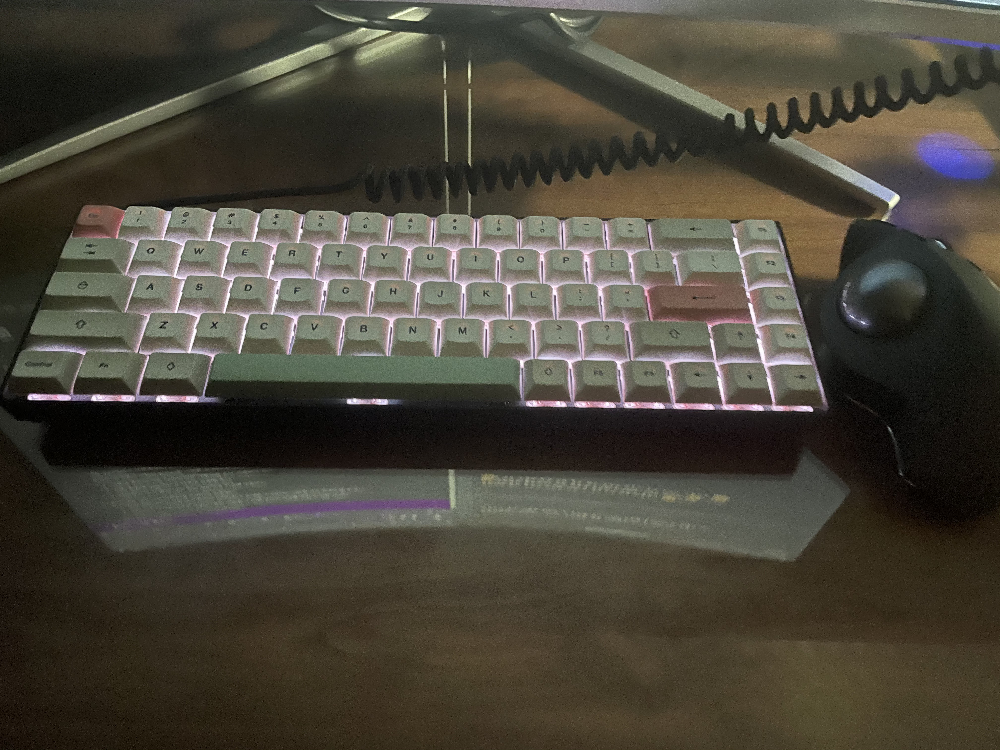

# 오늘 한 일

- Crash Course 내용 정리
   - '배운 점, 느낀 점' 의 첫 번째 구간까지 작성했다.
- 에니그마 기계에 대해 공부했다.
   - 제2차 세계대전에서 독일군이 사용한 기계다.
   - 특정 문자를 다른 문자로 변환하는 암호화 기계다.
   - 회전자와 플러그판을 이용해 암호화 규칙을 설정할 수 있다.
   - 올바른 설정을 통해 암호화된 문자를 해독할 수 있다.
   - 앨런 튜링은 정부 암호 연구소에서 에니그마의 설정을 알아내기 위해 일했다.
- 봄브에 대해 공부했다.
   - 에니그마 기계의 설정을 알아내기 위해 사용된 기계다.
   - 앨런 튜링이 폴란드 암호 해독가들의 작업을 기반으로 설계했다.
   - 일반 문자와 암호 문자가 같을 수 없다는 에니그마의 결함을 이용한다.
      - 일반 문자와 암호 문자의 조합을 비교해, 둘이 같은 경우를 폐기한다.
- 튜링 테스트에 대해 공부했다.
   - 앨런 튜링의 가정을 기반으로 한 간단한 테스트다.
      - 컴퓨터가 인간의 지능과 동등한, 혹은 구분할 수 없을 정도의 지능을 보일 수 있을 것이다.
      - 어떤 컴퓨터가 인간을 속여 자신이 인간이라고 믿게 할 수 있다면, 그것을 지적 존재라 할 수 있다.
   - 두 대상에 대한 지적인 능력에 대해서만 판별한다.
      - 대면하지 않고, 음성 대신 문자 정보만을 이용해 소통한다.
      - 어떤 질문에 대해서도 두 대상은 답변한다.
      - 이렇게 질문에 대한 대상의 답변 내용만을 보고 판별해야 한다.
   - 테스트 과정에서 사람과 컴퓨터를 구분할 수 없다면, 해당 컴퓨터는 튜링 테스트를 통과한 것이다.
   - 가끔 인터넷에서 귀찮게 하던 문제인 캡차는 현대판 튜링 테스트다.

# 생각 정리

- 기존 키보드가 이상해서, 전에 쓰던 키보드를 다시 사용하기로 했다.
   - 편하긴 하지만, 접촉 불량 문제가 계속 발생한다..
   - 팔을 벌려 사용할 수 없으니, 팔을 쭉 뻗어서 키보드를 사용하기로 했다.  
     `(손목, 어깨를 일자로 만들면, 통증이 줄어들지 않을까 싶다..)`
   - 분할 키보드(Mistel MD600) -> 65% 키보드(키크론 k6)
   - 

갬성은 역시..

      

     

- 앨런 튜링.. 그는 도대체.. ㅠㅠㅜㅠㅜ
   - 튜링의 죽음에 관한 내용을 정리할 때, 정말 마음이 아팠다..
   - 이런 멋진 사람이 더 연구할 수 있는 세상이었다면 어땠을까..
   - 검색해보니 당시 튜링의 공헌은 군사 기밀로 취급되었다고 한다..
   - 대중들에겐 '유명 대학 교수의 은밀한 성적 취향!?' 정도로 받아들여졌다고 한다..
   - 동성애자를 보면 꼭 응원해줘야겠다는 생각이 들었다.
      - 법적으로 처벌받지 않더라도, 눈치 보느라 마음고생을 엄청 할 것 같다..

# 내일 할 일

- Crash Course 내용 정리
   - '15' 의 내용 정리를 마무리하는 것이 목표다.
   - '16' 의 대제목 분류까지 하는 것이 목표다.
- 자료 구조, 알고리즘 수업 정리
   - '알고리즘 시간복잡도 BigO' 라는 강의 내용을 정리할 예정이다.
- 추가 목표
   - GDG 수원 행사 참여 후기 작성하기
   - 잘못된 맞춤법 찾아서 수정하기
   - 블로그 이슈 추가하기
   - 'About' 페이지 작성하기
   - 알고리즘 관련 글 옮기기
