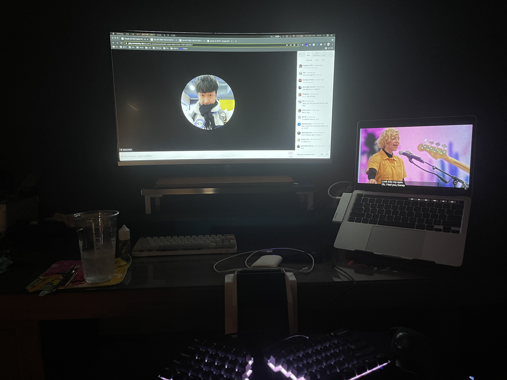

# 오늘 한 일

- 새벽에 Google I/O 기조연설을 들었다.
   - 엊그제에 GDG 서울의 관련 행사에 참가 신청을 했는데, TIL에 적는 것을 까먹고 있었다.
      - 'Google I/O 2021 Seoul Viewing Party' 라는 이름의 행사였다.
      - 함께 시청하면서(중간부터는 각자 시청) 채팅으로 소통했다.
   - 전체 행사 기조연설이 끝나자마자 너무 졸려서 그냥 자 버렸다.
      - 개발자 기조연설은 오늘 공부를 마치고, 자기 전에 볼 예정이다.
   - 엄청나게 졸린 상태였지만, 감상평(?) 을 간단하게 정리했다. `(정리충;)`
```
짧은 시간의 발표를 릴레이로 진행했음에도, 집중이 흐트러지지 않았다.
인공지능에 대한 도전, 사용자를 위한 배려에 대한 구글의 태도를 확실히 느낄 수 있었다.
더 나은 경험을 위한 노력과 인류에 대한 존중, 마무리로 환경 보호까지..
자신감에 찬 발표자분들의 목소리가 듣기 좋았고, 구글이 도전적이고 건강한 기업이라는 것을 느꼈다.
```
   - 태어나서 처음으로 참가한 Google I/O 였는데, '구글이 구글했다' 라는 생각이 들었다. ㅋㅋㅋ
   - 행사 시간이 새벽이라는 점은 조금 아쉬웠지만, 내용이 만족스러워서 괜찮았다.
      - 내년에 오프라인 행사로 진행한다면, 꼭 참가하고 싶다.

      <details><summary>오프닝 축하 공연 + 중개 없는 중개 행사 ㅋㅋㅋㅋㅋㅋ</summary>

      

      </details>
   - 애플 기기 사용자인데, 스마트폰만큼은 안드로이드로 바꾸고 싶다는 생각이 들었다. `(진심;)`
   - 한국 개발자 커뮤니티 라운지에 참가하지 못하는 것이 너무 아쉽다.
      - 물론, 대기자 명단에 등록은 해뒀다.. `( ㅠ ㅅㅜ)`
- Crash Course 내용 정리
   - '7. 컴퓨팅 장치의 상품화' 까지 정리했다.
- 산업 경쟁의 시작에 대해 공부했다.
   - 1950년대, 소비자 시장에서 트랜지스터 기반의 장치가 판매되기 시작했다.
      - 당시, 미국은 정부 지원에 의존하는 기술 발전이 한창이었다.
   - 그중에서도 트랜지스터라디오는 특히 인기를 끌었고, 엄청난 성공을 거뒀다.
   - 일본 정부는 이러한 성공을 전쟁 이후의 경제 부양에 대한 기회로 여겼다.
      - 벨 연구소에서 트랜지스터에 대한 권리를 허가받고, 산업체 성장을 지원했다.
   - 그렇게, Sony 에서 출시한 'TR-55' 트랜지스터라디오는 엄청난 인기를 끌었다.
   - 이렇게, 일본 기업들은 품질과 가격에 집중하여 소비자 시장 점유율을 높였다.
   - 이러한 역사적 배경은 이후에 이어지는 주요한 산업 경쟁의 시작점이 되었다.
- 우주 경쟁에 대해 공부했다.
   - 컴퓨팅 기술에서는 뒤처지던 소련이, 최초의 인공위성을 발사하는 데 성공했다.
      - 그 인공위성은 스푸트니크 1호였고, 최초로 우주에 다녀온 사람은 유리 가가린이었다. `(염동력 잘 쓸듯)`
   - 이것은 냉전 중이던 미국으로서는 매우 자존심 상하는 일이었다. `(케네디 : ㅂㄷㅂㄷ)`
   - 때문에, 미국은 10년 내로 사람을 달에 보내겠다는 목표를 세우고, 돈을 쏟아부었다. `(미국식 ㅗㅜㅑ)`
   - 미국은 엄청난 비용을 지불했고, 아폴로 계획에 성공하면서 우주 경쟁에서 이길 수 있었다.
- 집적 회로로의 전환에 대해 공부했다.
   - 미국과 소련의 우주 경쟁 당시, NASA의 거대한 도전 과제 중 하나는 우주 탐사였다.
   - 성공적인 우주 탐사를 위해선, 우주선에 관련된 여러 작업을 처리할 컴퓨터가 필요했다.
   - 하지만, 당시의 기술력으로는 빠르고, 작고, 가볍고, 안정성이 우수한 컴퓨터를 만들 수 없었다.
   - 따라서, 집적 회로라는 새로운 기술을 이용하게 되었고, 그렇게 아폴로 안내 컴퓨터가 개발되었다.
   - 집적 회로가 적용된 아폴로 안내 컴퓨터의 등장으로, 컴퓨터에 대한 인식이 크게 바뀌었다.
- 컴퓨팅 장치의 상품화에 대해 공부했다.
   - 아폴로 안내 컴퓨터는 컴퓨팅 기술을 집적 회로로 전환하는 데에 크게 기여했다.
   - 하지만, 아폴로 임무 자체는 그렇게 많지 않았고, 소량 생산되는 것에서 그쳤다.
   - 집적 회로의 대량 생산을 촉진한 실질적인 이유는 당시 미국에서 개발하던 군사적 요소들이었다.
   - 이렇게, 대량 생산으로 인한 발전은 슈퍼컴퓨터의 개발로 이어졌고, 기술 발전 속도는 더욱 빨라졌다.
   - 슈퍼컴퓨터는 엄청나게 비싸서, 주로 정부 계약으로 거래되었고, 덕분에 미국 기업들은 엄청난 호황을 누렸다.
   - 이렇게 미국이 정부 계약에 의존하는 와중에, 일본의 반도체 산업은 틈새시장을 공략하고 있었다.
      - 소비자 시장에서 발생하는 적은 이윤을 통해 규모의 경제를 실현하고자 했다.
      - 이를 위해 일본 기업들은 제조 비용과 품질을 개선하기 위해 엄청난 투자를 했다.
   - 시간이 흘러 1970년대, 우주 경쟁과 냉전이 잠잠해지면서 방위 계약의 수는 줄어만 갔다.
   - 그렇게, 정부 계약에 의존하던 미국 기업들은 점점 경쟁력을 잃어가기 시작했다.
   - 일본 기업의 품질과 가격에 대한 경쟁력은 이미 미국이 상대할 수 있는 정도가 아니었다.
   - 이렇게, 미국 기업들은 컴퓨터 관련 부품들의 상품화를 못 하고, 일본 기업들에 밀리고 말았다.

# 생각 정리

- 아무 이유 없이 갑자기 마라탕이 땡긴다. `(잠을 제대로 못 자서 그런가?)`
   - 금요일까지 꾹 참았다가, 야무지게 먹어야겠다. ㅋㅋㅋ
- 돈으로 밀어붙이는 미국과 틈새시장 일본.. 가슴이 웅장해질 수밖에 없었다.
   - 갑자기 1900년대를 배경으로 한 영화가 보고 싶어졌다. `(이미테이션 게임이나 볼까?)`

# 내일 할 일

- Crash Course 내용 정리
   - '24' 의 내용 정리를 마무리하는 것이 목표다.
- 추가 목표
   - 저장소, 코드 문서화하기
   - GDG 수원 행사 참여 후기 작성하기
   - 블로그 이슈 추가하기
   - 'About' 페이지 작성하기
   - 알고리즘 관련 글 옮기기
