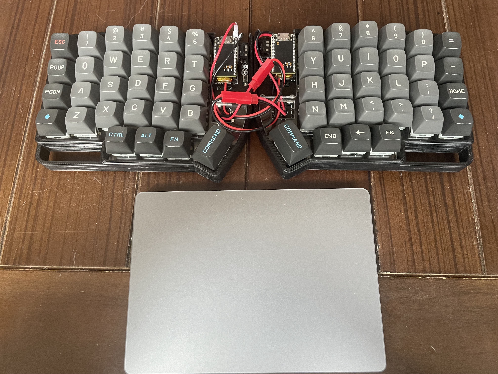

오늘 알고리즘 문제는 최소 신장 트리를 구하는 방법만 알면 쉽게 풀 수 있는 문제였다.

- 네트워크 연결 문제는 최소 신장 트리를 구성하는 간선 비용을 구하는 식으로 풀었다.
- 문제를 풀기 전에 'BaaarkingDog' 님 영상으로 복습했다. (막상 풀려니 좀 막막했음..)

 

오늘은 키보드 케이스를 바꿨다. (며칠 전에 3D 프린터 출력 업체에 주문 제작 의뢰함)

- 생각은 하고 있었는데, 맘에 드는 디자인을 찾아서 바로 견적부터 상담받고 주문했다.  
  `(손목 받침 일체형, 키보드 각도 조절형 -> 휴대하기 불편할 것 같아서 걍 다른 거로 함;)`
- 3D 모델링으로 탈착형 손목 받침대를 만들어볼까 생각 중이다. (모델링 배우고 싶다!)
- 원래는 슬라이드 스위치를 달려고 했는데 금방 망가질 것 같아서 일단 미루기로 했다.  
  `(일단은 푸쉬락 스위치 주문해 둠 -> 크기 딱 맞으면 땜질로 기판에 붙여서 고정할 생각임)`
- 바꾼 김에, 키캡도 수수와타리 키캡으로 바꿔줬다. (갬성 + 깐지는 못 참지 ㄹㅇㅋㅋ!)
  

lily58 pro + 3D printed case + susuwatari keycap + nice!nano

  
  

