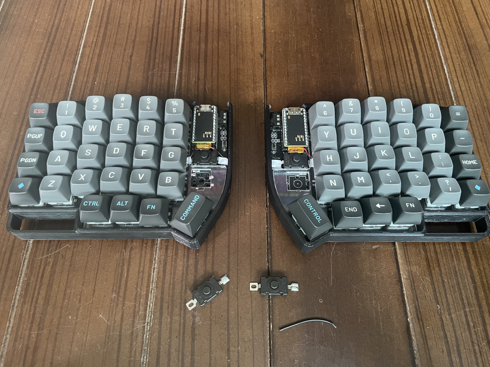

오늘 알고리즘 문제는 2차원 평면 위의 정점들로 최소 신장 트리를 구성하는 문제였다.

- 별자리 만들기 문제는 간선 비용을 계산한 뒤에 최소 신장 트리를 구성해서 풀었다.
- 가능한 모든 정점 쌍에 대해서 간선 비용을 구하도록 구현했다. (피타고라스, 땡큐!)

 

오늘은 키보드의 전원 연결 제어부를 개선했다. (이제 전원 제어도 편하게 할 수 있다!!)

- JST 커넥터를 제거하고, 배선 구조를 바꾼 다음, 푸쉬락 버튼 스위치를 추가해줬다.
- 맨 처음에는 PCB 기반의 빈 부분에 스위치를 땜질해서 붙이려고 했다가 실패했다..  
  `(그냥 절연 테이프로 연결하고 아크릴 케이스 부분으로 눌러서 고정하는 식으로 해결함..)`
- 절연 테이프가 하얀색이라 조금 어색하긴 한데, 나중에 시간이 되면 바꿔줘야겠다..
  

lily58 pro + 3D printed case + susuwatari keycap + nice!nano + 1812-28A

  
  

