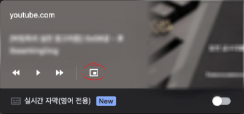

## 전제 조건

| 항목 | 내용 | 버전 |
|-|-|-|
| 운영체제 | macOS | (Catalina 10.15.7) |
| 브라우저 | Google Chrome | 92.0.4515.159(공식 빌드) (x86\_64) |

```
환경이 다른 경우, 글의 내용이 도움이 되지 않을 수 있음
```

## 한 줄 요약

> 크롬 브라우저의 'PIP(Picture-In-Picture) 모드' 를 활용하면 된다.

## 방법1

1. 우선, PIP 모드로 보고자 하는 유튜브 영상을 재생한다.
2. 영상의 화면 부분에 마우스 커서를 올리고 우클릭을 2번 한다.
3. 우클릭 후에 나온 메뉴에서 'PIP 모드' 를 찾아 클릭한다.
   <details><summary>참고 사진</summary>

   

   </details>

## 방법2

1. '방법1' 과 마찬가지로, 보고자 하는 유튜브 영상을 재생한다.
2. 브라우저 주소창 오른쪽에 있는 플레이리스트 아이콘을 클릭한다.
   <details><summary>참고 사진</summary>

   

   </details>
3. PIP 모드로 재생하고자 하는 영상을 찾아, PIP 아이콘을 클릭한다.
   <details><summary>참고 사진</summary>

   

   </details>
