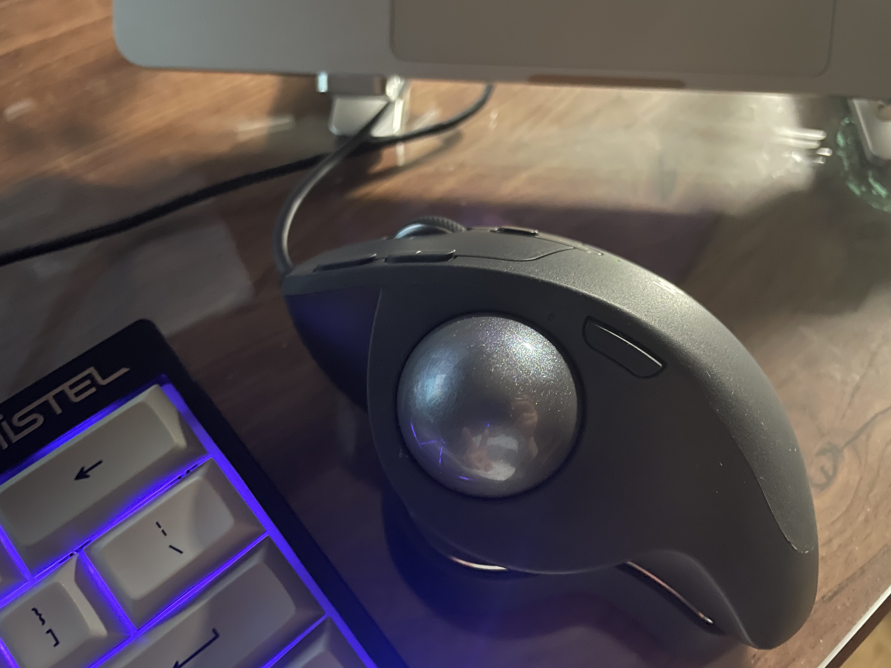

# 오늘 한 일

- 프로그래머스 알고리즘 문제를 풀었다.
   - '베스트앨범' 이라는 문제를 풀었다.
   - 여러 조건에 맞춰 정렬하는 문제였다.
   - 클래스를 활용하는 풀이가 인상깊었다.
- Crash Course 내용 정리
   - '1. 두 수를 더하는 프로그램' 까지 정리했다.
- CPU에서 프로그램이 실행되는 과정을 살펴봤다.
   - 지난 수업(6) 에서 사용한 프로그램을 복습했다.
   - 2진수 값을 명령 코드와 정보 위치로 바꿔봤다.
   - 별도의 해석없이 내용 그대로만 볼 수 있어서 편했다.

# 생각 정리

- 알고리즘 문제는 정말 알다가도 모르겠다.
   - 레벨 3이길래 훨씬 더 어렵고 복잡한 내용일 줄 알았다.
   - 레벨이 낮은 다른 문제들보다 훨씬 더 쉬웠던 것 같다.  
     `물론, 쉬움 난이도가 훨씬 어렵게 느껴질 때도 있긴 하다..`
   - 많은 기대를 하고 문제를 풀었는데, 뭔가 허무했다..
- 주말 사이에 주문한 트랙볼 마우스가 도착했다!
   - 그립감, 조작감, 스펙, 디자인, 가격 모두 맘에 든다!
   - 처음에는 트랙패드 쓰던 습관 때문에 볼을 꾹꾹 눌렀다..`<(ㅇ -ㅇ);;`
   - 적응하는데 몇 분도 안걸렸고, 손목이 편ㅡ안해졌다 ㅋㅋㅋ
   - 

동글동글 트랙볼~

      
     

# 내일 할 일

- Crash Course 내용 정리
   - '8' 의 내용 정리를 마무리짓는 것이 목표다.
- 추가 목표
   - 알고리즘 관련 글 옮기기
   - 'About' 페이지 작성하기
